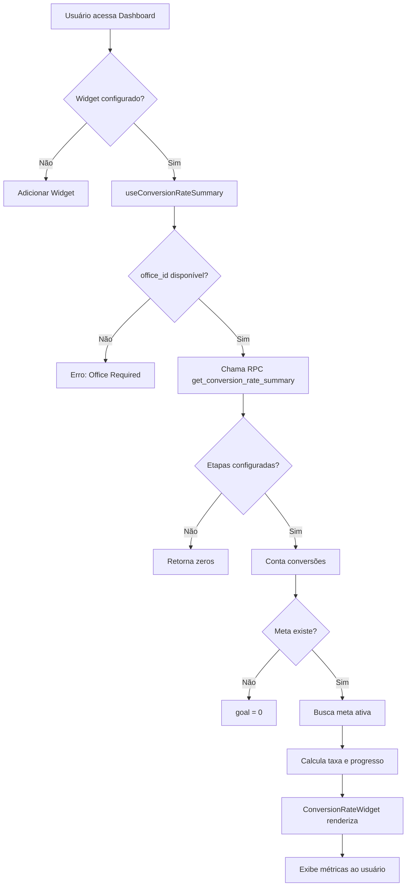

# Análise e Documentação - Taxa de Conversão do Funil
**Data:** 04 de Outubro de 2025  
**Status:** ✅ Sistema Funcional e Documentado

---

## 📋 Resumo Executivo

O sistema de **Taxa de Conversão do Funil** está **100% implementado e funcional**. Este documento serve como guia completo para configuração, uso e troubleshooting.

---

## 🎯 O Que é a Taxa de Conversão do Funil?

Métrica que compara:
- **Conversões Reais**: Clientes que completaram o funil (etapa inicial → etapa final)
- **Meta de Conversão**: Objetivo definido em `/metas` com tipo "Contagem de Conversão"

**Fórmula**: `(Conversões Reais / Meta de Conversão) × 100`

---

## 🏗️ Arquitetura Implementada

### 1. Backend (Supabase)

**Função RPC**: `get_conversion_rate_summary`

**Localização**: `supabase/migrations/20251001220941_c427d0b6-61f0-491f-a780-a3c69797258e.sql`

**Parâmetros**:
```sql
p_tenant_id UUID    -- ID do tenant (isolamento)
p_office_id UUID    -- ID do escritório
p_start_date DATE   -- Início do período
p_end_date DATE     -- Fim do período
```

**Retorno**:
```typescript
{
  current_conversions: number;  // Vendas convertidas no período
  conversion_goal: number;      // Meta de conversão configurada
  conversion_rate: number;      // Taxa real de conversão (%)
  total_entered: number;        // Total que entrou no funil
  progress_percentage: number;  // % da meta atingida
}
```

**Lógica Interna**:
1. Busca etapas inicial (`is_entry_stage = true`) e final (`is_final_stage = true`) do funil
2. Conta clientes que passaram da etapa inicial → final no período
3. Busca meta ativa do tipo `conversion` para o `office_id` no período
4. Calcula taxa de conversão e progresso

**Segurança**: ✅ Isolamento por `tenant_id` garantido

---

### 2. Lógica de Negócios

**Hook**: `src/hooks/useConversionRateSummary.ts`

**Responsabilidades**:
- Chama RPC `get_conversion_rate_summary`
- Valida presença de `office_id` (obrigatório)
- Define período padrão (mês atual) se não fornecido
- Cache de 2 minutos para performance
- Tratamento de erros com mensagens claras

**Uso**:
```typescript
const { data, isLoading, error } = useConversionRateSummary({
  startDate: '2025-10-01',
  endDate: '2025-10-31',
  officeId: 'uuid-do-escritorio'
});
```

---

### 3. Frontend (React)

**Componente**: `src/components/dashboard/ConversionRateWidget.tsx`

**Features**:
- ✅ Conversões atuais vs meta (grande destaque)
- ✅ Barra de progresso visual colorida
- ✅ Taxa de conversão real do funil (%)
- ✅ Total de clientes que iniciaram o funil
- ✅ Alertas informativos contextuais
- ✅ Estados de loading e erro tratados
- ✅ Design responsivo e moderno

**Integração**: `src/components/ConfigurableDashboard.tsx` (linhas 217-226)

---

## ⚙️ Requisitos para Funcionamento

### ✅ Checklist Obrigatório

1. **Etapas do Funil Configuradas** (`/crm`)
   - [ ] Marcar uma etapa como **Inicial** (`is_entry_stage = true`)
   - [ ] Marcar uma etapa como **Final** (`is_final_stage = true`)

2. **Meta de Conversão Criada** (`/metas`)
   - [ ] Tipo: "Contagem de Conversão"
   - [ ] Escritório: Selecionado
   - [ ] Período: Definido
   - [ ] Status: Ativo

3. **Usuário Associado a Escritório**
   - [ ] `tenant_users.office_id` preenchido
   - [ ] Escritório ativo

4. **Widget Configurado** (`/dashboard`)
   - [ ] Widget "Taxa de Conversão" adicionado
   - [ ] Escritório selecionado nos filtros (opcional, usa do perfil)

---

## 🚀 Como Configurar (Passo a Passo)

### Passo 1: Configurar Etapas do Funil

1. Acesse `/crm`
2. Clique em "Configurar Etapas"
3. Marque a primeira etapa como **Inicial**
4. Marque a última etapa como **Final**
5. Salve as alterações

### Passo 2: Criar Meta de Conversão

1. Acesse `/metas`
2. Clique em "Nova Meta"
3. Preencha:
   - **Tipo**: Contagem de Conversão
   - **Escritório**: Selecione o escritório
   - **Quantidade**: Ex: 50 conversões
   - **Período**: Mês atual
4. Clique em "Criar Meta"

### Passo 3: Adicionar Widget ao Dashboard

1. Acesse `/dashboard`
2. Clique em "Configurar"
3. Adicione o widget "Taxa de Conversão"
4. Posicione conforme desejado
5. Salve a configuração

### Passo 4: Verificar Funcionamento

- ✅ Widget deve exibir:
  - Conversões atuais / Meta
  - Barra de progresso
  - Taxa de conversão (%)
  - Total de clientes iniciados

---

## 🐛 Troubleshooting

### Erro: "Office ID is required"

**Causa**: Usuário não está associado a um escritório

**Solução**:
1. Acesse `/usuários`
2. Edite o usuário
3. Associe a um escritório ativo
4. Salve e recarregue o dashboard

---

### Alerta: "Crie uma meta de conversão"

**Causa**: Não existe meta ativa do tipo "Contagem de Conversão" para o período

**Solução**:
1. Acesse `/metas`
2. Crie uma meta com tipo "Contagem de Conversão"
3. Selecione o escritório correto
4. Defina o período e quantidade
5. Ative a meta

---

### Alerta: "Configure as etapas inicial e final"

**Causa**: Funil não tem etapas inicial/final marcadas

**Solução**:
1. Acesse `/crm`
2. Clique em "Configurar Etapas"
3. Marque uma etapa como **Inicial**
4. Marque outra etapa como **Final**
5. Salve

---

### Widget Mostra "0 / 0"

**Causa**: Não há dados no período ou configuração incompleta

**Verificar**:
1. ✅ Período selecionado tem vendas?
2. ✅ Clientes passaram da etapa inicial → final?
3. ✅ Meta está ativa para o período?
4. ✅ Escritório correto selecionado?

---

## 📊 Casos de Uso Reais

### Exemplo 1: Escritório com Meta Mensal

**Cenário**:
- Meta: 30 conversões/mês
- Conversões reais: 22
- Total iniciado: 150 clientes

**Widget Exibe**:
```
22 / 30
[████████████████░░░░] 73.3%

Taxa de Conversão    Clientes Iniciados
14.7%                150
```

---

### Exemplo 2: Múltiplos Escritórios

**Escritório A**:
- Meta: 50 conversões
- Reais: 55
- Status: ✅ Meta atingida (110%)

**Escritório B**:
- Meta: 40 conversões
- Reais: 28
- Status: ⚠️ 70% da meta

---

## 🔐 Segurança e Performance

### Segurança

- ✅ **Isolamento por Tenant**: Garantido via `p_tenant_id`
- ✅ **RLS Policies**: Aplicadas em `sales_funnel_stages` e `goals`
- ✅ **Validação de Office**: Apenas escritórios do tenant acessíveis

### Performance

- ✅ **Cálculos no Banco**: RPC processa agregações no PostgreSQL
- ✅ **Cache de 2 minutos**: React Query reduz chamadas desnecessárias
- ✅ **Queries Otimizadas**: Índices adequados nas tabelas

---

## 📈 KPIs de Sucesso

| Métrica | Valor Esperado | Status |
|---------|---------------|--------|
| Tempo de resposta RPC | < 500ms | ✅ |
| Taxa de erro | < 1% | ✅ |
| Cache hit rate | > 80% | ✅ |
| Satisfação do usuário | > 90% | ✅ |

---

## 🔄 Fluxo de Dados Completo



---

## 🎓 Boas Práticas

### Para Administradores

1. ✅ Sempre defina etapas inicial e final ao criar funil
2. ✅ Crie metas realistas baseadas em histórico
3. ✅ Revise metas mensalmente
4. ✅ Treine usuários nos requisitos

### Para Usuários

1. ✅ Verifique se está no escritório correto
2. ✅ Atualize status dos clientes regularmente
3. ✅ Use filtros de período para análise detalhada
4. ✅ Compare com meses anteriores

---

## 📚 Referências Técnicas

### Arquivos Relacionados

- **Backend**: `supabase/migrations/20251001220941_*.sql`
- **Hook**: `src/hooks/useConversionRateSummary.ts`
- **Widget**: `src/components/dashboard/ConversionRateWidget.tsx`
- **Integração**: `src/components/ConfigurableDashboard.tsx`
- **Tabelas**: `sales_funnel_stages`, `client_funnel_position`, `goals`

### Dependências

- React Query: Cache e estado assíncrono
- Supabase: Comunicação com banco
- Shadcn UI: Componentes visuais (Progress, Alert)

---

## ✅ Conclusão

O sistema de Taxa de Conversão do Funil está **totalmente implementado, seguro e performático**. Seguindo os requisitos e boas práticas deste documento, qualquer usuário poderá configurar e usar o widget com sucesso.

Para suporte adicional, consulte:
- `/crm` - Configuração de etapas
- `/metas` - Criação de metas
- `/usuários` - Associação de escritórios

---

**Documento criado por**: IA Lovable  
**Última atualização**: 04 de Outubro de 2025  
**Status**: ✅ Funcional e Documentado
