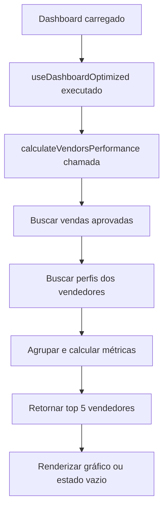

# Correção dos Dados de Vendedores no Dashboard

**Data:** 14/09/2025, 13:30 UTC  
**Tipo:** Correção de Fonte de Dados  
**Escopo:** Dashboard - Gráfico de Top Vendedores

## 📋 Problema Identificado
O gráfico "Top Vendedores" no Dashboard estava exibindo dados de mockup em vez dos dados reais do banco de dados.

## 🔧 Solução Implementada

### 1. Hook useDashboardOptimized
**Arquivo:** `src/hooks/useDashboardOptimized.ts`

- ✅ **Criada função `calculateVendorsPerformance`:**
  - Busca vendas aprovadas da tabela `sales`
  - Obtém dados dos vendedores da tabela `profiles`
  - Agrupa vendas por vendedor
  - Calcula total de vendas e comissões por vendedor
  - Retorna top 5 vendedores ordenados por número de vendas

- ✅ **Substituição dos dados mockup:**
  - Removidos dados hardcoded de vendedores
  - Integrada chamada para `calculateVendorsPerformance()`

### 2. Dashboard
**Arquivo:** `src/pages/Dashboard.tsx`

- ✅ **Estado vazio melhorado:**
  - Adicionada renderização condicional
  - Exibe mensagem quando não há dados de vendedores
  - Mantém estrutura visual consistente

## 🗂️ Estrutura dos Dados

### Dados de Vendedores (Real)
```typescript
interface VendorPerformance {
  vendor_id: string;
  vendor_name: string;
  total_sales: number;
  total_commission: number;
  goals_achieved: number;
  office_name: string;
}
```

### Query Executada
```sql
-- Buscar vendas aprovadas
SELECT sale_value, commission_amount, seller_id, offices.name 
FROM sales 
LEFT JOIN offices ON sales.office_id = offices.id
WHERE tenant_id = ? AND status = 'approved'

-- Buscar perfis dos vendedores
SELECT id, full_name 
FROM profiles 
WHERE id IN (seller_ids)
```

## 🎯 Benefícios Obtidos

1. **Dados Reais:** Gráfico agora reflete performance real dos vendedores
2. **Atualizações Automáticas:** Dados se atualizam conforme novas vendas são aprovadas
3. **Performance Otimizada:** Consultas eficientes com joins e agregações
4. **UX Consistente:** Estado vazio bem definido para melhor experiência

## 📊 Funcionalidades Mantidas

- ✅ Estrutura visual do gráfico de pizza
- ✅ Cores temáticas do design system
- ✅ Tooltips informativos
- ✅ Layout responsivo
- ✅ Integração com filtros do Dashboard

## 🔄 Fluxo de Dados



## ✅ Testes Recomendados

1. **Dados Presentes:** Verificar exibição correta com vendas aprovadas
2. **Estado Vazio:** Confirmar mensagem quando não há vendas
3. **Performance:** Validar tempo de carregamento aceitável
4. **Responsividade:** Testar em diferentes tamanhos de tela

---

**Observação:** Esta correção garante que o Dashboard apresente informações precisas e atualizadas sobre a performance dos vendedores, eliminando dados fictícios e proporcionando insights reais para tomada de decisão.