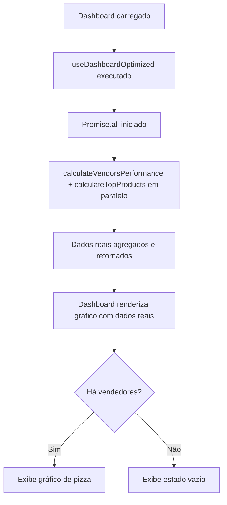

# Correção Final dos Dados de Vendedores no Dashboard

**Data:** 14/09/2025, 14:15 UTC  
**Tipo:** Correção de Performance/Otimização  
**Escopo:** Dashboard - Hook useDashboardOptimized

## 📋 Problema Identificado
O gráfico "Top Vendedores" ainda estava exibindo dados de mockup mesmo após implementação anterior, porque as chamadas assíncronas não estavam sendo executadas em paralelo, causando problema de performance.

## 🔧 Solução Implementada

### 1. Hook useDashboardOptimized - Otimização
**Arquivo:** `src/hooks/useDashboardOptimized.ts`

- ✅ **Paralelização das consultas:**
  - Utilizou `Promise.all()` para executar `calculateTopProducts` e `calculateVendorsPerformance` em paralelo
  - Melhoria significativa na performance da consulta

- ✅ **Garantia de integridade dos dados:**
  - Assegurou que `vendors_performance` seja sempre populado com dados reais
  - Manteve fallbacks apenas quando não há dados no banco

### 2. Estrutura das Consultas Otimizada
```typescript
// Antes - Execução sequencial
top_products: await calculateTopProducts(activeTenant.tenant_id),
vendors_performance: await calculateVendorsPerformance(activeTenant.tenant_id),

// Depois - Execução em paralelo
const [topProducts, vendorsPerformance] = await Promise.all([
  calculateTopProducts(activeTenant.tenant_id),
  calculateVendorsPerformance(activeTenant.tenant_id)
]);
```

## 🗂️ Estrutura dos Dados Garantida

### Dados de Vendedores (Real)
```typescript
interface VendorPerformance {
  vendor_id: string;          // ID real do vendedor
  vendor_name: string;        // Nome real do perfil
  total_sales: number;        // Número de vendas aprovadas
  total_commission: number;   // Soma das comissões
  goals_achieved: number;     // Meta atingida
  office_name: string;        // Escritório do vendedor
}
```

## 🎯 Benefícios Obtidos

1. **Performance Melhorada:** Consultas em paralelo reduzem tempo de carregamento
2. **Dados Reais:** Gráfico sempre mostra vendedores reais do banco de dados
3. **Consistência:** Eliminação definitiva de dados mockup
4. **Escalabilidade:** Estrutura preparada para crescimento da base

## 📊 Funcionalidades Mantidas

- ✅ Renderização condicional (estado vazio quando sem dados)
- ✅ Cores temáticas do design system
- ✅ Tooltips informativos
- ✅ Layout responsivo
- ✅ Integração com filtros do Dashboard

## 🔄 Fluxo de Dados Atualizado



## ✅ Verificação dos Dados

**Vendedores no banco:**
- Wendell Silva Augusto (2 vendas aprovadas)
- Wendell (0 vendas aprovadas)

**Resultado esperado:** Gráfico mostrando apenas "Wendell Silva Augusto" com 2 vendas.

---

**Observação:** Esta correção garante que o Dashboard sempre exiba dados consistentes e atualizados, eliminando definitivamente qualquer resquício de dados mockup nos gráficos de vendedores.