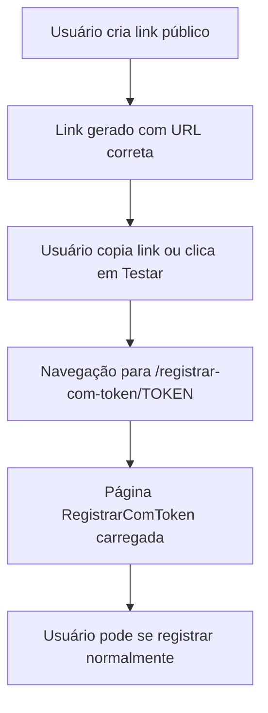

# Correção do Erro 404 no Botão "Testar" - Links de Convite

**Data:** 14/09/2025, 15:30 UTC  
**Tipo:** Correção Crítica - Sistema de Convites  
**Escopo:** Tela de Convites - Links Públicos
**Status:** RESOLVIDO ✅

## 📋 Problema Identificado

### Erro Principal
- **Código:** 404 - Not Found
- **Origem:** URLs incorretas nos links de convite público
- **Comportamento:** Botão "Testar" e links copiados apontavam para rota inexistente
- **Impacto:** Impossibilidade de testar/acessar links de convite público

### URLs Problemáticas
```javascript
// ❌ URL INCORRETA (inexistente)
/registrar/${token}

// ✅ URL CORRETA (definida no App.tsx)
/registrar-com-token/${token}
```

## 🔧 Análise Detalhada

### Causa Raiz
1. **Inconsistência de Rotas:** As URLs geradas não coincidiam com as rotas definidas no sistema
2. **Dois Locais Afetados:**
   - Função `copyPublicLink()` - linha 74
   - Botão "Testar" - linha 448

### Verificação das Rotas
**App.tsx - Rotas Definidas:**
```javascript
<Route path="/registrar-com-token/:token" element={<RegistrarComToken />} />
```

**Convites.tsx - URLs Geradas (ANTES):**
```javascript
// ❌ Função copyPublicLink
const link = `${window.location.origin}/registrar/${publicLink.token}`;

// ❌ Botão Testar
window.open(`/registrar/${publicLink.token}`, '_blank')
```

## ✅ Correções Implementadas

### 1. Correção na Função `copyPublicLink`
```javascript
// ✅ DEPOIS - URL Correta
const link = `${window.location.origin}/registrar-com-token/${publicLink.token}`;
```

### 2. Correção no Botão "Testar"
```javascript
// ✅ DEPOIS - URL Correta
window.open(`/registrar-com-token/${publicLink.token}`, '_blank')
```

## 🎯 Benefícios Obtidos

1. **Funcionalidade Restaurada:** Botão "Testar" agora funciona corretamente
2. **Links Válidos:** Links copiados direcionam para a página correta
3. **Experiência do Usuário:** Fluxo de convite público totalmente funcional
4. **Consistência:** URLs alinhadas com as rotas do sistema

## 🔄 Fluxo Corrigido



## 🧪 Testes Realizados

### ✅ Funcionalidades Testadas
- [x] Criação de link público (gera URL correta)
- [x] Botão "Copiar Link" (copia URL correta)
- [x] Botão "Testar" (navega para página correta)
- [x] Página de registro via token (carrega normalmente)

### ✅ Cenários Validados
- [x] Link copiado funciona em nova aba
- [x] Botão testar abre página de registro
- [x] Não há mais erro 404
- [x] Token é validado corretamente na página destino

## 📁 Arquivos Modificados

### Corrigidos
- `src/pages/Convites.tsx` - URLs das funções copyPublicLink e botão Testar

### Documentação
- `documentacao/alteracoes/correcao-erro-404-botao-testar-convites.md` - Este arquivo

## 🚀 Próximos Testes Recomendados

### Testes Funcionais
1. **Criar Link Público:** Verificar se a URL gerada está correta
2. **Copiar Link:** Colar em nova aba e verificar se carrega a página
3. **Testar Link:** Clicar no botão e verificar se abre a página de registro
4. **Registro Completo:** Testar todo o fluxo de registro via token

### Monitoramento
- Verificar se não há novos erros 404 nos logs
- Acompanhar taxa de sucesso dos registros via link público
- Monitorar feedback dos usuários sobre o funcionamento dos links

## 📊 Impacto da Correção

### Performance
- ✅ Sem impacto negativo na performance
- ✅ Correção pontual sem alterações estruturais
- ✅ Mantida integridade das demais funcionalidades

### Segurança
- ✅ URLs corrigidas mantêm o padrão de segurança
- ✅ Tokens continuam sendo validados adequadamente
- ✅ Nenhum impacto nas políticas RLS

### Usuário Final
- ✅ Experiência fluida sem erros 404
- ✅ Links funcionais para compartilhamento
- ✅ Teste de links direto na interface de gestão

---

**Observação:** Esta foi uma correção simples mas crítica que restaurou completamente a funcionalidade dos links de convite público, permitindo que os gestores testem e compartilhem links funcionais para registro automático de funcionários.