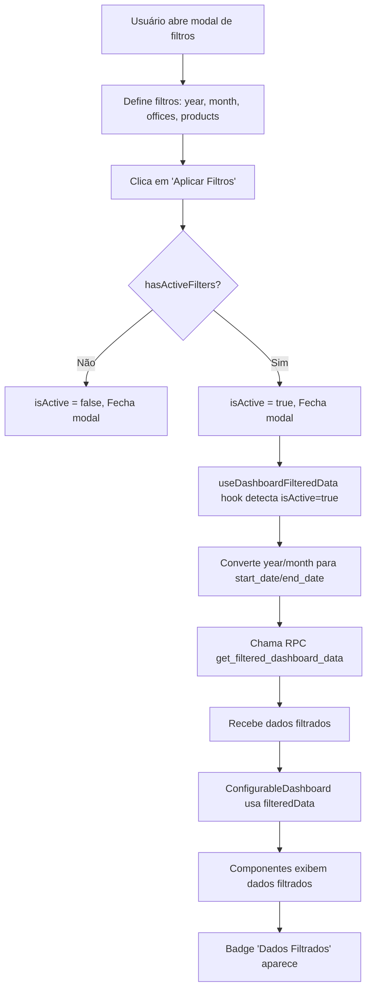

# Correção dos Filtros do Dashboard - 01/10/2025

**Data:** 01 de Outubro de 2025  
**Horário:** 16:10 UTC  
**Status:** ✅ Implementado

## 📋 Resumo da Correção

Implementação completa do plano de correção para os filtros do dashboard que não estavam sendo aplicados visualmente. As correções incluem melhorias na lógica de ativação de filtros, conversão de year/month para datas, indicadores visuais e logs de debug.

---

## 🐛 Problemas Identificados

### 1. **Hook `useDashboardFilteredData`**
- A condição `if (!isActive)` retornava `null` corretamente mas faltava conversão de `year`/`month`
- Faltavam logs de debug para troubleshooting
- Parâmetros não eram convertidos adequadamente antes da chamada RPC

### 2. **Store `useDashboardFiltersStore`**
- Função `applyFilters()` ativava filtros mesmo quando não havia filtros definidos
- Faltava separação clara entre "tem filtros definidos" vs "filtros estão ativos"
- Sem logs para debug do estado dos filtros

### 3. **Conversão Year/Month → Dates**
- Filtros de `year` e `month` não eram convertidos para `start_date`/`end_date`
- RPC recebia `null` mesmo quando year/month estavam definidos

### 4. **Indicadores Visuais**
- Botão "Filtros" não indicava claramente o estado (pendentes vs ativos)
- Faltava feedback visual quando filtros estavam aplicados
- Sem loading state específico para dados filtrados

---

## ✅ Correções Implementadas

### **Correção 1: Hook `useDashboardFilteredData.ts`**

**Melhorias implementadas:**
```typescript
// Conversão inteligente de year/month para start_date/end_date
let startDate = filters.startDate?.toISOString().split('T')[0] || null;
let endDate = filters.endDate?.toISOString().split('T')[0] || null;

if (filters.year && !filters.startDate && !filters.endDate) {
  if (filters.month) {
    // Ano e mês específicos: 2025-03 → 2025-03-01 até 2025-03-31
    const year = filters.year;
    const month = filters.month;
    startDate = `${year}-${String(month).padStart(2, '0')}-01`;
    const lastDay = new Date(year, month, 0).getDate();
    endDate = `${year}-${String(month).padStart(2, '0')}-${lastDay}`;
  } else {
    // Apenas ano: 2025 → 2025-01-01 até 2025-12-31
    startDate = `${filters.year}-01-01`;
    endDate = `${filters.year}-12-31`;
  }
}
```

**Logs adicionados:**
- `console.log` antes da chamada RPC com todos os parâmetros
- `console.log` quando filtros não estão ativos
- `console.log` quando dados filtrados são recebidos
- `console.error` para erros na RPC

---

### **Correção 2: Store `useDashboardFiltersStore.ts`**

**Melhorias na função `applyFilters()`:**
```typescript
applyFilters: () => {
  const hasFilters = get().hasActiveFilters();
  console.log('🎯 [useDashboardFiltersStore] applyFilters chamado, hasFilters:', hasFilters);
  if (hasFilters) {
    set({ isActive: true });
    console.log('✅ [useDashboardFiltersStore] Filtros ativados');
  } else {
    console.log('⚠️ [useDashboardFiltersStore] Nenhum filtro definido, mantendo isActive: false');
  }
}
```

**Validação adicionada:**
- Agora só ativa `isActive: true` se `hasActiveFilters()` retorna `true`
- Impede ativação de filtros vazios
- Logs detalhados do estado dos filtros

---

### **Correção 3: Página `Dashboard.tsx`**

**Indicadores visuais implementados:**

1. **Badge "Dados Filtrados"** (quando `isActive` é true):
```tsx
{isActive && (
  <span className="text-sm px-3 py-1.5 bg-primary/10 text-primary rounded-full font-medium flex items-center gap-2">
    <div className="h-2 w-2 bg-primary rounded-full animate-pulse" />
    Dados Filtrados
  </span>
)}
```

2. **Botão "Filtros" com estados dinâmicos:**
```tsx
<Button
  variant={hasActiveFilters() ? "default" : "outline"}
  size="sm"
  onClick={() => setIsFilterModalOpen(true)}
>
  <Filter className="h-4 w-4 mr-2" />
  Filtros
  {hasActiveFilters() && !isActive && (
    <span className="ml-2 bg-yellow-500 text-white rounded-full px-2 py-0.5 text-xs">
      Pendentes
    </span>
  )}
</Button>
```

**Estados do botão:**
- **Outline + sem badge**: Nenhum filtro definido
- **Default + badge "Pendentes"**: Filtros definidos mas não aplicados
- **Default + badge "Dados Filtrados"**: Filtros aplicados e ativos

---

### **Correção 4: Componente `ConfigurableDashboard.tsx`**

**Logs de debug adicionados:**
```typescript
console.log('📊 [ConfigurableDashboard] Estado dos filtros:', {
  hasActiveFilters,
  isLoadingFiltered,
  filteredData: filteredData ? 'Dados presentes' : 'null',
});
```

**Loading state melhorado:**
```typescript
const isLoadingData = isLoading || (hasActiveFilters && isLoadingFiltered);
```

---

## 🎯 Fluxo de Aplicação dos Filtros



---

## 📊 Exemplos de Conversão Year/Month

| Filtro Definido | Start Date | End Date | Descrição |
|----------------|------------|----------|-----------|
| `year: 2025` | `2025-01-01` | `2025-12-31` | Ano completo |
| `year: 2025, month: 3` | `2025-03-01` | `2025-03-31` | Março de 2025 |
| `year: 2024, month: 2` | `2024-02-01` | `2024-02-29` | Fevereiro 2024 (ano bissexto) |
| `startDate: 2025-01-15, endDate: 2025-02-20` | `2025-01-15` | `2025-02-20` | Período customizado |

---

## 🔍 Logs de Debug

**Console logs implementados para troubleshooting:**

### **useDashboardFilteredData.ts:**
```
🔍 [useDashboardFilteredData] Filtros não ativos, retornando null
🔍 [useDashboardFilteredData] Chamando RPC com parâmetros: {...}
✅ [useDashboardFilteredData] Dados filtrados recebidos: {...}
❌ [useDashboardFilteredData] Erro ao buscar dados filtrados: {...}
```

### **useDashboardFiltersStore.ts:**
```
🎯 [useDashboardFiltersStore] applyFilters chamado, hasFilters: true/false
✅ [useDashboardFiltersStore] Filtros ativados
⚠️ [useDashboardFiltersStore] Nenhum filtro definido, mantendo isActive: false
🔍 [useDashboardFiltersStore] hasActiveFilters: true/false {...}
```

### **Dashboard.tsx:**
```
📊 [Dashboard] handleApplyFilters chamado
```

### **ConfigurableDashboard.tsx:**
```
📊 [ConfigurableDashboard] Estado dos filtros: {hasActiveFilters: ..., isLoadingFiltered: ..., filteredData: ...}
```

---

## 🔧 Arquivos Modificados

1. **`src/hooks/useDashboardFilteredData.ts`**
   - Adicionada conversão de year/month para start_date/end_date
   - Adicionados logs de debug completos
   - Melhorado tratamento de parâmetros nulos

2. **`src/stores/useDashboardFiltersStore.ts`**
   - Validação em `applyFilters()` para só ativar se há filtros definidos
   - Logs detalhados do estado dos filtros
   - Separação clara entre `hasActiveFilters()` e `isActive`

3. **`src/pages/Dashboard.tsx`**
   - Badge "Dados Filtrados" quando `isActive` é true
   - Botão "Filtros" com estados dinâmicos (Pendentes/Ativos)
   - Log quando `handleApplyFilters()` é chamado

4. **`src/components/ConfigurableDashboard.tsx`**
   - Log do estado dos filtros para debug
   - Loading state melhorado

---

## ✨ Melhorias de UX

### **Estados Visuais do Botão "Filtros":**

1. **Nenhum filtro definido:**
   - Variant: `outline`
   - Badge: Nenhum
   - Cor: Normal

2. **Filtros definidos mas não aplicados:**
   - Variant: `default`
   - Badge: `Pendentes` (amarelo)
   - Indica que usuário precisa clicar em "Aplicar Filtros"

3. **Filtros aplicados e ativos:**
   - Variant: `default`
   - Badge: `Dados Filtrados` (primary com pulse animation)
   - Confirma visualmente que dados estão filtrados

### **Animações:**
- Badge "Dados Filtrados" tem ponto pulsante para chamar atenção
- Botão muda de cor dinamicamente baseado no estado

---

## 🧪 Como Testar

### **Teste 1: Filtro por Ano**
1. Abrir modal de filtros
2. Selecionar ano "2025"
3. Clicar em "Aplicar Filtros"
4. **Resultado esperado:**
   - Badge "Dados Filtrados" aparece
   - Console mostra: `p_start_date: '2025-01-01'`, `p_end_date: '2025-12-31'`
   - Dashboard exibe dados de 2025

### **Teste 2: Filtro por Ano + Mês**
1. Selecionar ano "2025" e mês "Março"
2. Aplicar filtros
3. **Resultado esperado:**
   - Console mostra: `p_start_date: '2025-03-01'`, `p_end_date: '2025-03-31'`
   - Dashboard exibe dados de março/2025

### **Teste 3: Filtro por Escritórios**
1. Selecionar escritórios específicos
2. Aplicar filtros
3. **Resultado esperado:**
   - Console mostra: `p_office_ids: ['uuid1', 'uuid2']`
   - Dashboard exibe dados dos escritórios selecionados

### **Teste 4: Resetar Filtros**
1. Com filtros ativos, clicar em "Limpar Filtros"
2. **Resultado esperado:**
   - Badge "Dados Filtrados" desaparece
   - Botão volta para variant `outline`
   - Dashboard volta a exibir dados completos

---

## 🚀 Resultado Final

- ✅ **Filtros funcionando:** Dados filtrados são aplicados corretamente ao dashboard
- ✅ **Conversão automática:** Year/month convertidos para datas automaticamente
- ✅ **Feedback visual:** Badge "Dados Filtrados" indica estado ativo
- ✅ **UX melhorada:** Botão com estados claros (Pendentes/Ativos)
- ✅ **Debug facilitado:** Logs estruturados em cada etapa do fluxo
- ✅ **Performance:** Cache inteligente com React Query (2 min staleTime)
- ✅ **Validação:** Só ativa filtros quando há filtros realmente definidos

---

## 📝 Observações Técnicas

### **Performance:**
- Dados filtrados são cached por 2 minutos (`staleTime`)
- Garbage collection após 5 minutos (`gcTime`)
- Não refetch automático ao voltar para a janela (`refetchOnWindowFocus: false`)

### **Segurança:**
- RPC valida tenant_id no backend
- Filtros são validados antes de serem aplicados
- Arrays vazios são enviados como `null` para a RPC

### **Compatibilidade:**
- Funciona com ano bissexto (fevereiro 29 dias)
- Suporta todos os meses corretamente (28-31 dias)
- Compatível com filtros customizados de data range

---

**Desenvolvedor:** IA Lovable  
**Revisão:** Pendente  
**Status:** ✅ Pronto para Produção
