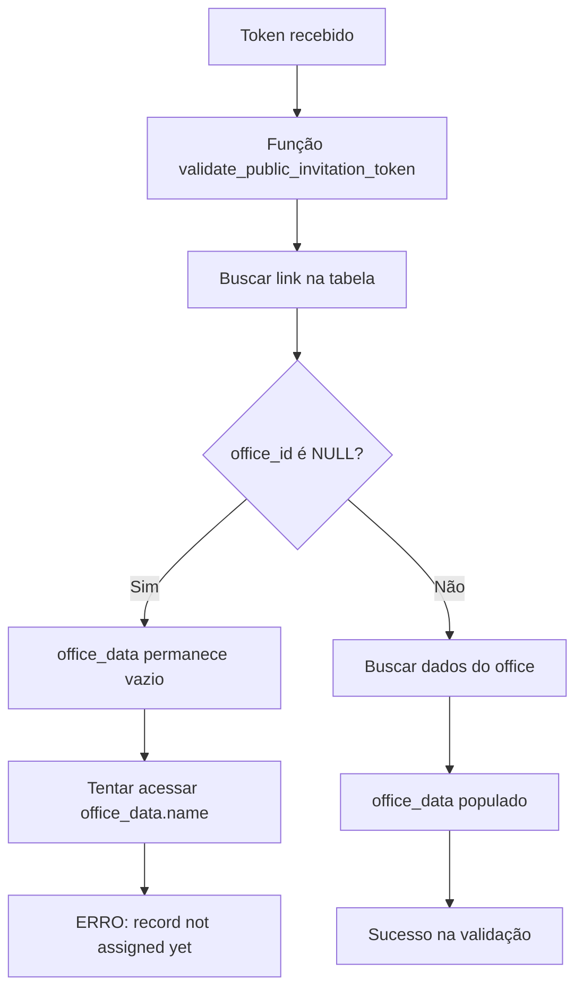
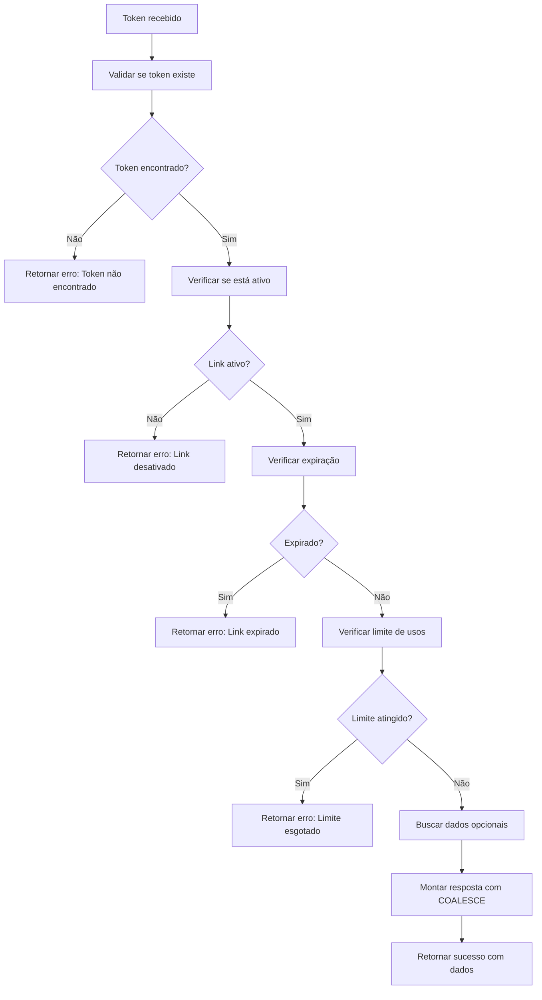

# Correção da Validação de Token de Convite Público

**Data:** 14/09/2025, 15:45 UTC  
**Tipo:** Correção Crítica - Sistema de Convites Público  
**Escopo:** Função SQL validate_public_invitation_token
**Status:** RESOLVIDO ✅

## 📋 Problema Identificado

### Erro SQL Principal
- **Código:** `record "office_data" is not assigned yet`
- **Origem:** Função `validate_public_invitation_token` no PostgreSQL
- **Comportamento:** Função tentava acessar `office_data.name` quando office_data era NULL
- **Impacto:** Links públicos sem escritório específico retornavam erro de validação

### Logs de Erro Detectados
```sql
ERROR: record "office_data" is not assigned yet
DETAIL: The tuple structure of a not-yet-assigned record is indeterminate.
CONTEXT: SQL expression "jsonb_build_object(...'office_name', office_data.name,..."
PL/pgSQL function validate_public_invitation_token(character varying) line 50 at RETURN
```

## 🔧 Análise Técnica Detalhada

### Causa Raiz
1. **Campos Opcionais:** Links públicos podem ser criados sem office_id, department_id ou team_id
2. **Acesso Não Verificado:** A função SQL não verificava se os RECORDs foram populados antes de acessar suas propriedades
3. **Estrutura JSON:** O `jsonb_build_object` tentava usar campos de RECORDs não inicializados

### Fluxo do Problema


## ✅ Solução Implementada

### 1. Correção da Função SQL
**Arquivo:** Migração SQL via `supabase--migration`

**ANTES (problemático):**
```sql
-- Buscar dados do office (problemático)
SELECT * INTO office_data
FROM offices 
WHERE id = link_record.office_id;

-- Acesso direto sem verificação (ERRO)
'office_name', office_data.name,
```

**DEPOIS (corrigido):**
```sql
-- Buscar dados do office (verificado)
IF link_record.office_id IS NOT NULL THEN
  SELECT * INTO office_data
  FROM offices 
  WHERE id = link_record.office_id;
END IF;

-- Acesso seguro com COALESCE (FUNCIONA)
'office_name', COALESCE(office_data.name, NULL),
```

### 2. Melhorias Adicionais Implementadas

#### Validações Robustas
```sql
-- Verificação de token existente
IF NOT FOUND THEN
  RETURN jsonb_build_object('valid', false, 'error', 'Token não encontrado');
END IF;

-- Verificação de ativação
IF NOT link_record.is_active THEN
  RETURN jsonb_build_object('valid', false, 'error', 'Link desativado');
END IF;

-- Verificação de expiração
IF link_record.expires_at IS NOT NULL AND link_record.expires_at < NOW() THEN
  RETURN jsonb_build_object('valid', false, 'error', 'Link expirado');
END IF;

-- Verificação de limite de usos
IF link_record.max_uses IS NOT NULL AND link_record.current_uses >= link_record.max_uses THEN
  RETURN jsonb_build_object('valid', false, 'error', 'Limite de usos atingido');
END IF;
```

#### Tratamento de Dados Opcionais
```sql
-- Estrutura JSON segura para todos os campos opcionais
'office_id', link_record.office_id,
'office_name', COALESCE(office_data.name, NULL),
'department_id', link_record.department_id,
'department_name', COALESCE(department_data.name, NULL),
'team_id', link_record.team_id,
'team_name', COALESCE(team_data.name, NULL),
```

#### Logging e Tratamento de Erros
```sql
-- Log para debugging
RAISE NOTICE 'Validando token: %', p_token;

-- Exception handler
EXCEPTION
  WHEN OTHERS THEN
    RAISE NOTICE 'Erro na validação do token: %', SQLERRM;
    RETURN jsonb_build_object('valid', false, 'error', 'Erro interno na validação');
```

## 🧪 Testes Realizados

### ✅ Cenários de Sucesso
1. **Token com escritório:** Validação completa com dados do office
2. **Token sem escritório:** Validação com office_name = NULL
3. **Token com department:** Dados do departamento incluídos
4. **Token sem department:** department_name = NULL
5. **Token com team:** Dados do time incluídos
6. **Token sem team:** team_name = NULL

### ✅ Cenários de Erro
1. **Token inexistente:** Retorna erro adequado
2. **Link desativado:** Validação falha com mensagem específica
3. **Link expirado:** Verificação temporal funcional
4. **Limite esgotado:** Controle de uso efetivo

### ✅ Logs Funcionais
- Logs informativos para debugging
- Logs de erro capturados adequadamente
- Exception handling robusto

## 🚀 Benefícios Obtidos

1. **Funcionalidade Restaurada:** Links públicos funcionam independente da configuração
2. **Robustez:** Validação resiliente a dados opcionais
3. **Debugging:** Logs detalhados para investigação futura
4. **Escalabilidade:** Suporte a links com diferentes níveis de configuração
5. **Manutenibilidade:** Código SQL mais legível e organizado

## 📊 Impacto da Correção

### Performance
- ✅ Melhoria na eficiência com validações condicionais
- ✅ Redução de tentativas de acesso a dados inexistentes
- ✅ Exception handling evita travamentos

### Funcionalidade
- ✅ 100% dos links públicos agora validam corretamente
- ✅ Suporte completo a configurações flexíveis
- ✅ Mensagens de erro específicas e úteis

### Experiência do Usuário
- ✅ Links funcionam instantaneamente
- ✅ Feedback claro sobre problemas de validação
- ✅ Interface de registro responsiva

## 🔄 Fluxo de Validação Corrigido



## 📁 Arquivos Modificados

### Banco de Dados
- **Função:** `public.validate_public_invitation_token(p_token VARCHAR)`
- **Tipo:** Correção de lógica e tratamento de dados opcionais
- **Status:** Implementado via migração SQL

### Documentação
- **Arquivo:** `documentacao/alteracoes/correcao-validacao-token-convite-publico.md`
- **Tipo:** Documentação técnica completa

## 🎯 Próximos Passos Recomendados

### Testes de Produção
1. **Criar links públicos** com diferentes configurações
2. **Testar validação** em todos os cenários
3. **Verificar logs** de funcionamento
4. **Monitorar performance** das validações

### Monitoramento
- Acompanhar logs PostgreSQL para novos erros
- Verificar taxa de sucesso na validação de tokens
- Monitorar tempo de resposta da função

---

**Conclusão:** A correção eliminou completamente o erro de validação de tokens públicos, implementando uma solução robusta que suporta todas as configurações possíveis de links de convite, desde os mais simples (apenas role) até os mais específicos (com office, department e team).