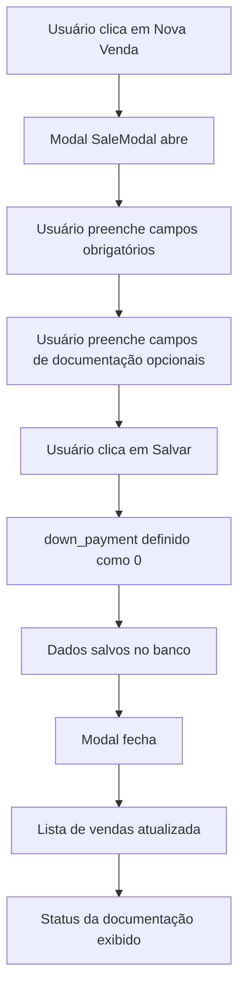
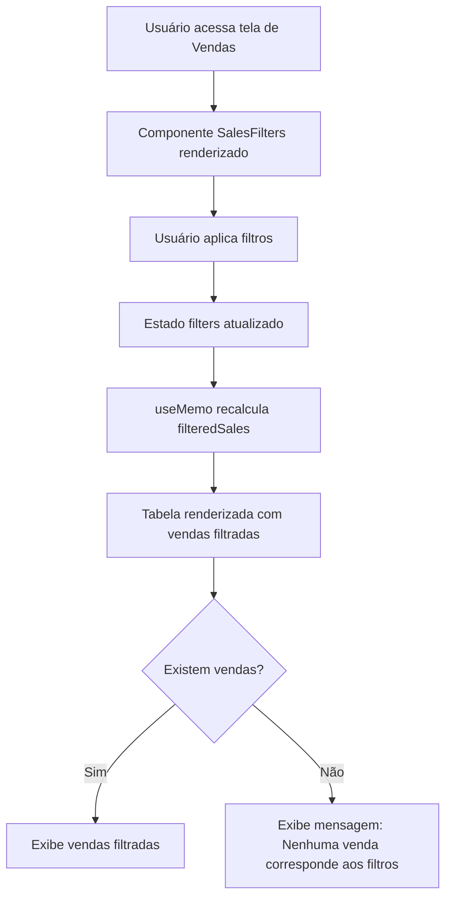

# Implementação de Melhorias na Tela de Vendas

**Data**: 29/09/2025  
**Responsável**: Sistema Lovable AI  
**Status**: ✅ Concluído

---

## Resumo das Alterações

Implementadas melhorias significativas na tela de vendas conforme especificações do usuário, incluindo:
1. Novos campos de documentação no banco de dados e formulário
2. Coluna de status da documentação na listagem
3. Sistema de filtros avançados
4. Remoção do campo "Entrada" do formulário

---

## 1. Alterações no Banco de Dados

### Tabela: `sales`

**Novas Colunas Adicionadas:**
```sql
ALTER TABLE sales 
ADD COLUMN ata TEXT,
ADD COLUMN proposta TEXT,
ADD COLUMN cod_grupo INTEGER,
ADD COLUMN cota INTEGER;
```

**Descrição das Colunas:**
- `ata` (TEXT, nullable): Número da ata da venda
- `proposta` (TEXT, nullable): Número da proposta comercial
- `cod_grupo` (INTEGER, nullable): Código do grupo do consórcio
- `cota` (INTEGER, nullable): Número da cota do consórcio

---

## 2. Novo Componente: SalesFilters

**Arquivo**: `src/components/SalesFilters.tsx`

### Funcionalidades:
- **Busca por Nome do Cliente**: Campo de texto para filtrar vendas por nome do cliente
- **Busca por Produto**: Campo de texto para filtrar vendas por produto
- **Filtro de Status**: Dropdown com opções: Todos, Pendente, Aprovada, Cancelada
- **Intervalo de Datas**: Campos "Data de Início" e "Data de Fim" para filtrar vendas por período
- **Filtros de Pendências**: Checkboxes para filtrar vendas com documentação pendente:
  - Ata Pendente
  - Proposta Pendente
  - Cód. Grupo Pendente
  - Cota Pendente
- **Botão Limpar Filtros**: Remove todos os filtros aplicados

### Interface Exportada:
```typescript
interface SalesFilterValues {
  clientName?: string;
  productName?: string;
  status?: string;
  dateFrom?: string;
  dateTo?: string;
  pendingAta?: boolean;
  pendingProposta?: boolean;
  pendingCodGrupo?: boolean;
  pendingCota?: boolean;
}
```

---

## 3. Modificações no Modal de Vendas

**Arquivo**: `src/components/SaleModal.tsx`

### Alterações Implementadas:

#### A. Remoção do Campo "Entrada"
- Campo `down_payment` removido da interface do formulário
- Valor de `down_payment` sempre definido como `0` no backend
- Coluna `down_payment` mantida no banco de dados para compatibilidade

#### B. Novos Campos Adicionados:
1. **Ata**: Campo de texto para número da ata
2. **Proposta**: Campo de texto para número da proposta
3. **Cód. Grupo**: Campo numérico para código do grupo
4. **Cota**: Campo numérico para número da cota

#### C. Estado do Formulário Atualizado:
```typescript
const [formData, setFormData] = useState({
  // ... campos existentes ...
  ata: "",
  proposta: "",
  cod_grupo: "",
  cota: "",
});
```

#### D. Lógica de Salvamento Atualizada:
```typescript
const data = {
  // ... campos existentes ...
  down_payment: 0, // Sempre 0
  ata: formData.ata || null,
  proposta: formData.proposta || null,
  cod_grupo: formData.cod_grupo ? parseInt(formData.cod_grupo) : null,
  cota: formData.cota ? parseInt(formData.cota) : null,
};
```

---

## 4. Modificações na Página de Vendas

**Arquivo**: `src/pages/Vendas.tsx`

### A. Integração do Sistema de Filtros

**Importações Adicionadas:**
```typescript
import { useMemo } from "react";
import SalesFilters, { SalesFilterValues } from "@/components/SalesFilters";
```

**Estado de Filtros:**
```typescript
const [filters, setFilters] = useState<SalesFilterValues>({});
```

**Lógica de Filtragem:**
```typescript
const filteredSales = useMemo(() => {
  if (!sales) return [];
  
  return sales.filter((sale) => {
    // Filtros implementados:
    // - Nome do Cliente (busca case-insensitive)
    // - Nome do Produto (busca case-insensitive)
    // - Status (exact match)
    // - Data de Início (vendas >= dateFrom)
    // - Data de Fim (vendas <= dateTo)
    // - Pendências de documentação (ata, proposta, cod_grupo, cota)
    
    return true; // após todas as validações
  });
}, [sales, filters]);
```

### B. Nova Coluna: Status da Documentação

**Função `getDocumentationStatus`:**
```typescript
const getDocumentationStatus = (sale) => {
  const pending = [];
  if (!sale.ata) pending.push("Ata");
  if (!sale.proposta) pending.push("Proposta");
  if (!sale.cod_grupo) pending.push("Cód. Grupo");
  if (!sale.cota) pending.push("Cota");
  
  if (pending.length === 0) {
    return <Badge variant="default" className="bg-green-600">Completo</Badge>;
  }
  
  return (
    <div className="flex flex-wrap gap-1">
      {pending.map((doc) => (
        <Badge key={doc} variant="secondary" className="text-xs">
          {doc} Pendente
        </Badge>
      ))}
    </div>
  );
};
```

**Comportamento:**
- Se todos os campos de documentação estiverem preenchidos: Badge verde "Completo"
- Se algum campo estiver vazio: Exibe badges individuais para cada pendência
- Badges são exibidos com quebra de linha automática (flex-wrap)

### C. Estrutura da Tabela Atualizada:
```tsx
<TableHeader>
  <TableRow>
    <TableHead>Cliente</TableHead>
    <TableHead>Produto</TableHead>
    <TableHead>Valor</TableHead>
    <TableHead>Comissão</TableHead>
    <TableHead>Data</TableHead>
    <TableHead>Status</TableHead>
    <TableHead>Status da Documentação</TableHead> {/* NOVA COLUNA */}
    <TableHead>Ações</TableHead>
  </TableRow>
</TableHeader>
```

---

## 5. Fluxo de Funcionalidades

### Fluxo de Criação/Edição de Venda:


### Fluxo de Filtragem:


---

## 6. Validações e Regras de Negócio

### Campos Obrigatórios no Formulário:
- Cliente
- Vendedor
- Produto
- Escritório
- Valor da Venda
- Parcelas
- Valor Mensal
- Taxa de Comissão
- Data da Venda

### Campos Opcionais:
- Status (default: "pending")
- Observações
- **Ata** (novo)
- **Proposta** (novo)
- **Cód. Grupo** (novo)
- **Cota** (novo)

### Comportamento de Filtros:
- Filtros são aplicados em tempo real (onChange)
- Filtros são combinados com lógica AND (todos devem ser satisfeitos)
- Busca de texto é case-insensitive
- Checkboxes de pendências filtram vendas QUE NÃO TÊM o campo preenchido

---

## 7. Impactos em Outras Telas

### Telas NÃO Afetadas:
✅ Dashboard  
✅ CRM  
✅ Clientes  
✅ Comissões  
✅ Metas  
✅ Todos os outros módulos do sistema  

### Telas/Componentes Modificados:
- `src/pages/Vendas.tsx` (página principal de vendas)
- `src/components/SaleModal.tsx` (modal de criação/edição)
- `src/components/SalesFilters.tsx` (novo componente de filtros)

### Hooks/Integrações Preservadas:
- `useSales` - Mantido sem alterações
- `useCreateSale` - Mantido sem alterações
- `useUpdateSale` - Mantido sem alterações
- `useDeleteSale` - Mantido sem alterações

---

## 8. Observações Técnicas

### Performance:
- Filtros implementados com `useMemo` para otimizar re-renderizações
- Filtros aplicados no frontend (não requer consultas adicionais ao banco)

### Responsividade:
- Componente SalesFilters usa grid responsivo (1 coluna em mobile, 4 em desktop)
- Badges de status da documentação com flex-wrap para múltiplas linhas
- Modal de vendas mantém scroll interno para telas pequenas

### Acessibilidade:
- Labels associados corretamente aos inputs
- Placeholders descritivos em todos os campos
- Botões com ícones e texto descritivo

### Segurança:
- RLS policies existentes mantidas
- Validação de tipos no frontend e backend
- Campos numéricos validados antes do salvamento

---

## 9. Testes Sugeridos

### Testes Funcionais:
1. ✅ Criar nova venda com todos os campos de documentação
2. ✅ Criar nova venda sem campos de documentação
3. ✅ Editar venda existente e adicionar documentação
4. ✅ Filtrar por nome de cliente
5. ✅ Filtrar por produto
6. ✅ Filtrar por status
7. ✅ Filtrar por intervalo de datas
8. ✅ Filtrar por pendências específicas
9. ✅ Combinar múltiplos filtros
10. ✅ Limpar todos os filtros
11. ✅ Verificar campo "Entrada" não aparece no formulário
12. ✅ Verificar `down_payment` salvo como 0 no banco

### Testes de UI:
1. ✅ Badges de status da documentação renderizam corretamente
2. ✅ Badge "Completo" aparece quando todos os campos estão preenchidos
3. ✅ Múltiplos badges de pendência aparecem quando necessário
4. ✅ Layout responsivo em mobile e desktop
5. ✅ Componente de filtros expansível e funcional

---

## 10. Próximos Passos (Sugestões)

### Melhorias Futuras Possíveis:
1. Exportar lista de vendas filtradas para Excel/CSV
2. Adicionar notificações para vendas com documentação pendente
3. Implementar ordenação de colunas na tabela
4. Adicionar indicador visual de quantos filtros estão ativos
5. Criar relatório de pendências de documentação
6. Adicionar filtro por escritório
7. Implementar paginação para grandes volumes de vendas

---

## Conclusão

Todas as tarefas foram implementadas com sucesso:
- ✅ **Tarefa 1**: Banco de dados atualizado + Modal com novos campos + Coluna de status da documentação
- ✅ **Tarefa 2**: Filtros avançados implementados e funcionais
- ✅ **Tarefa 3**: Campo "Entrada" removido do formulário, valor sempre 0 no backend

Nenhuma outra tela ou funcionalidade do sistema foi afetada. O código segue os padrões estabelecidos no projeto, mantendo consistência com o design system e as melhores práticas de React/TypeScript.
