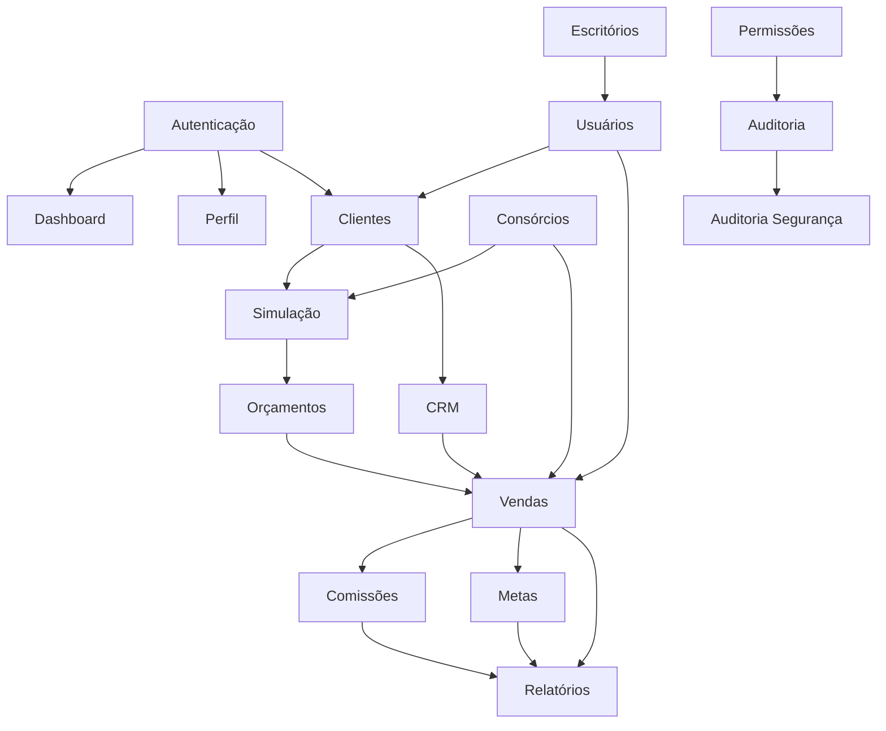

# 📦 Plano de Modularização - Sistema Argus360
**Data:** 02/10/2025  
**Objetivo:** Estruturar o sistema em 3 pacotes (Básico, Intermediário, Avançado) com análise detalhada por tela

---

## 📋 Sumário Executivo

O sistema Argus360 atualmente possui **36 telas/funcionalidades** principais distribuídas entre:
- 28 páginas de usuário final
- 8 páginas administrativas
- Sistema multi-tenant completo
- Controle de acesso granular por roles

### Proposta de Modularização

```
┌─────────────────────────────────────────────────────────────┐
│  PACOTE BÁSICO (Core MVP)                                    │
│  8 Telas Essenciais - Base Operacional                      │
│  Investimento: R$ XXX/mês                                   │
└─────────────────────────────────────────────────────────────┘
                          │
                          ▼
┌─────────────────────────────────────────────────────────────┐
│  PACOTE INTERMEDIÁRIO (Professional)                         │
│  +13 Telas - Gestão Avançada                                │
│  Investimento: R$ XXX/mês                                   │
└─────────────────────────────────────────────────────────────┘
                          │
                          ▼
┌─────────────────────────────────────────────────────────────┐
│  PACOTE AVANÇADO (Enterprise)                                │
│  +15 Telas - Analytics & Controle Total                     │
│  Investimento: R$ XXX/mês                                   │
└─────────────────────────────────────────────────────────────┘
```

---

## 🎯 PACOTE BÁSICO (Core MVP)
**Objetivo:** Operação mínima viável para iniciar vendas de consórcios

### ✅ Funcionalidades Incluídas (8 Telas)

#### 1. **Autenticação & Onboarding** 
- 🔐 **Login** (`/login`)
  - Acesso via email/senha
  - Recuperação de senha
  - Autenticação segura via Supabase
  
- 📝 **Registro** (`/register`)
  - Cadastro inicial da empresa (tenant)
  - Primeiro usuário (owner)
  - Aceite de termos LGPD

- 🔗 **Aceitar Convite** (`/aceitar-convite/:token`)
  - Sistema de convites para novos usuários
  - Validação de token único
  - Vinculação automática ao tenant

**Tabelas DB:** `auth.users`, `tenants`, `profiles`, `tenant_users`, `invitations`

---

#### 2. **Dashboard Básico** (`/dashboard`)
**Funcionalidades Limitadas:**
- ✅ Métricas essenciais:
  - Total de clientes cadastrados
  - Total de vendas realizadas
  - Valor total de vendas (mês atual)
  - Taxa de conversão básica
  
- ✅ Gráfico simples de vendas mensais (últimos 6 meses)
- ✅ Lista de últimas 5 vendas
- ❌ Sem widgets configuráveis
- ❌ Sem comparativos entre escritórios
- ❌ Sem análise preditiva

**Tabelas DB:** `clients`, `sales`, `tenant_users`

**Hooks Necessários:** 
```typescript
// Simplificados para o básico
useBasicDashboardMetrics()
useRecentSales(limit: 5)
```

---

#### 3. **Gestão de Clientes** (`/clientes`)
**Funcionalidades Core:**
- ✅ Listagem de clientes (paginação obrigatória: 50/página)
- ✅ Cadastro de novo cliente
  - Dados básicos: Nome, CPF/CNPJ, Email, Telefone
  - Tipo: Pessoa Física/Jurídica
  - Status: Prospecto, Ativo, Inativo
- ✅ Edição de dados do cliente
- ✅ Busca por nome/documento
- ✅ Filtro por status
- ❌ Sem histórico de interações
- ❌ Sem classificação avançada (cold/warm/hot)
- ❌ Sem funil de vendas
- ❌ Sem transferência de clientes

**Tabelas DB:** `clients`

**Validações:**
- CPF/CNPJ único por tenant
- Email válido
- Telefone obrigatório

---

#### 4. **Produtos de Consórcio** (`/consorcios`)
**Funcionalidades Essenciais:**
- ✅ Listagem de produtos de consórcio
- ✅ Cadastro de novo produto
  - Nome do produto
  - Categoria (Auto, Imóvel, Moto, Serviços)
  - Valor mínimo e máximo do crédito
  - Prazo (meses)
  - Taxa de administração (%)
  - Taxa de comissão padrão (%)
  - Status (Ativo/Inativo)
- ✅ Edição de produto
- ✅ Desativação de produto
- ❌ Sem configuração de tabelas de chargeback
- ❌ Sem múltiplos índices de correção
- ❌ Sem histórico de alterações

**Tabelas DB:** `consortium_products`

**Validações:**
- Nome único por tenant
- Taxa de administração entre 0-100%
- Valor mínimo < valor máximo

---

#### 5. **Simulação de Consórcio** (`/simulacao-consorcio`)
**Funcionalidades Básicas:**
- ✅ Seleção de produto
- ✅ Entrada de valor desejado
- ✅ Cálculo automático de:
  - Valor da parcela mensal
  - Taxa de administração aplicada
  - Prazo total
  - Valor total do consórcio
- ✅ Visualização clara dos resultados
- ✅ Botão para "Registrar como Orçamento"
- ❌ Sem múltiplas simulações simultâneas
- ❌ Sem comparação entre produtos
- ❌ Sem consideração de lance/entrada

**Tabelas DB:** `consortium_products`, `proposals`

**Cálculos:**
```typescript
parcela = (valorBem * (1 + taxaAdmin/100)) / prazo
```

---

#### 6. **Orçamentos/Propostas** (`/proposals`)
**Funcionalidades Core:**
- ✅ Listagem de orçamentos salvos
- ✅ Criação manual de orçamento
  - Vinculação com cliente
  - Seleção de produto
  - Valor e prazo personalizados
- ✅ Visualização de detalhes do orçamento
- ✅ Edição de orçamento (antes de virar venda)
- ✅ Conversão de orçamento em venda
- ✅ Status: Rascunho, Enviado, Aprovado, Rejeitado
- ❌ Sem geração de PDF automático
- ❌ Sem envio por email
- ❌ Sem assinatura digital

**Tabelas DB:** `proposals`, `clients`, `consortium_products`

**Status Flow:**
```
Rascunho → Enviado → [Aprovado/Rejeitado] → Venda
```

---

#### 7. **Registro de Vendas** (`/vendas`)
**Funcionalidades Simplificadas:**
- ✅ Listagem de vendas (paginação: 50/página)
- ✅ Registro de nova venda
  - Cliente (busca)
  - Produto de consórcio
  - Valor da venda
  - Data da venda
  - Número do contrato (opcional)
  - Taxa de comissão (herdada do produto)
- ✅ Visualização de detalhes da venda
- ✅ Edição de venda (apenas status)
- ✅ Status básicos: Pendente, Aprovada, Cancelada
- ✅ Filtros: Data, Cliente, Status
- ❌ Sem aprovação de vendas
- ❌ Sem geração automática de comissões
- ❌ Sem controle de parcelas

**Tabelas DB:** `sales`, `clients`, `consortium_products`, `tenant_users`

**Campos Obrigatórios:**
- client_id
- product_id
- seller_id (usuário logado)
- sale_value
- sale_date

---

#### 8. **Perfil do Usuário** (`/perfil`)
**Funcionalidades Pessoais:**
- ✅ Visualização de dados pessoais
- ✅ Edição de:
  - Nome completo
  - Email (validação obrigatória)
  - Telefone
  - Avatar/Foto
- ✅ Troca de senha
- ✅ Visualização de role/permissões
- ❌ Sem histórico de atividades
- ❌ Sem configurações avançadas

**Tabelas DB:** `profiles`, `tenant_users`

---

### 🔒 Controle de Acesso - Pacote Básico

**Roles Suportados:**
- **Owner (Proprietário):** Acesso total às 8 telas
- **User (Usuário Padrão):** Acesso a todas exceto gestão de produtos

**RLS Policies Necessárias:**
```sql
-- Isolamento por tenant em todas as tabelas
-- Usuários só veem dados do próprio tenant
-- Owner pode gerenciar usuários e produtos
```

---

### 📊 Schema do Banco - Pacote Básico

**Tabelas Essenciais (11):**
```
auth.users (Supabase)
├── profiles (1:1)
├── tenants (1:N via tenant_users)
├── tenant_users (N:N)
├── invitations
└── clients
    └── sales
        └── consortium_products
            └── proposals
```

**Relacionamentos Críticos:**
- `sales.client_id → clients.id`
- `sales.product_id → consortium_products.id`
- `sales.seller_id → tenant_users.user_id`
- `proposals.client_id → clients.id`
- `proposals.product_id → consortium_products.id`

---

### 🚀 Implementação Técnica - Pacote Básico

#### Frontend Simplificado

**Componentes a Criar:**
```
src/
├── pages/
│   ├── basic/
│   │   ├── BasicDashboard.tsx
│   │   ├── BasicClientes.tsx
│   │   ├── BasicConsorcios.tsx
│   │   ├── BasicSimulacao.tsx
│   │   ├── BasicProposals.tsx
│   │   ├── BasicVendas.tsx
│   │   └── BasicPerfil.tsx
```

**Hooks Otimizados:**
```typescript
// Performance: cache de 5 minutos
useBasicClients() // Lista com paginação
useBasicProducts() // Lista de produtos ativos
useBasicSales() // Vendas do usuário/tenant
useBasicProposals() // Propostas ativas
```

#### Backend (Supabase Functions)

**RPCs Necessárias:**
```sql
-- 1. Dashboard Metrics
CREATE FUNCTION get_basic_dashboard_metrics(tenant_uuid UUID)
RETURNS JSON;

-- 2. Simulação de Consórcio
CREATE FUNCTION calculate_consortium_simulation(
  product_id UUID,
  desired_value NUMERIC
) RETURNS JSON;

-- 3. Conversão Proposta → Venda
CREATE FUNCTION convert_proposal_to_sale(proposal_id UUID)
RETURNS UUID;
```

---

### 💰 Estratégia de Monetização - Pacote Básico

**Modelo Sugerido:**
- **Plano Starter:** R$ 297/mês
  - Até 5 usuários
  - 500 clientes
  - 100 vendas/mês
  - Suporte via email (48h)

**Limitações Técnicas a Implementar:**
```typescript
// Middleware de controle
checkPlanLimits({
  maxUsers: 5,
  maxClients: 500,
  maxSalesPerMonth: 100
})
```

---

## 🚀 PACOTE INTERMEDIÁRIO (Professional)
**Objetivo:** Gestão profissional com controle de equipe e performance

### ✅ Funcionalidades Adicionais (+13 Telas)

#### 9. **CRM Completo** (`/crm`)
**Desbloqueio de Funcionalidades:**
- ✅ Funil de vendas visual (Kanban)
  - Arrastar e soltar clientes entre fases
  - Fases customizáveis por tenant
  - Probabilidade de conversão por fase
- ✅ Histórico de interações com cliente
  - Timeline de todas as interações
  - Tipos: Ligação, Email, WhatsApp, Reunião, Tarefa
  - Prioridade e resultado de cada interação
- ✅ Gestão de tarefas/follow-ups
  - Agendamento de ações futuras
  - Notificações de tarefas pendentes
  - Conclusão e registro de resultados
- ✅ Classificação de leads (Cold/Warm/Hot)
- ✅ Próximas tarefas do dia

**Novas Tabelas DB:** 
- `sales_funnel_stages` (fases do funil)
- `client_funnel_position` (posição do cliente no funil)
- `client_interactions` (histórico de interações)

**Complexidade Adicional:**
- Drag & drop com `@dnd-kit/core`
- Real-time updates via Supabase subscriptions
- Notificações push para tarefas

---

#### 10. **Gestão de Vendedores** (`/vendedores`)
- ✅ Listagem de todos os vendedores do tenant
- ✅ Visualização de performance individual
  - Total de vendas
  - Ticket médio
  - Taxa de conversão
  - Comissões geradas
- ✅ Ranking de vendedores
- ✅ Filtros por período e escritório
- ✅ Exportação de relatório (CSV)

**Queries Complexas:**
```sql
-- Performance de vendedor com agregações
SELECT 
  seller_id,
  COUNT(*) as total_sales,
  AVG(sale_value) as avg_ticket,
  SUM(commission_amount) as total_commission
FROM sales
WHERE tenant_id = $1 AND status = 'approved'
GROUP BY seller_id;
```

---

#### 11. **Comissões** (`/comissoes`)
- ✅ Listagem de comissões geradas
- ✅ Filtros: Vendedor, Status, Período
- ✅ Status: Pendente, Aprovada, Paga, Cancelada
- ✅ Aprovação em lote
- ✅ Registro de pagamento
- ✅ Geração automática de comissões após venda aprovada
- ✅ Comissões de escritório + vendedor (hierárquico)

**Novas Tabelas:**
- `commissions`
- `seller_commissions` (configuração de taxas por vendedor/produto)
- `commission_payment_schedules` (parcelamento)

**Lógica de Negócio Complexa:**
```typescript
// Hierarquia de comissões
Venda Aprovada → 
  1. Comissão do Escritório (% base) →
  2. Comissão do Vendedor (% da comissão do escritório)
```

---

#### 12. **Metas** (`/metas`)
- ✅ Criação de metas individuais e de equipe
- ✅ Tipos: Valor de vendas, Número de vendas, Conversão
- ✅ Período: Mensal, Trimestral, Anual
- ✅ Visualização de progresso em tempo real
- ✅ Dashboard de metas com gráficos
- ✅ Notificações de milestone atingido

**Tabelas:** `goals`

**Cálculos em Tempo Real:**
```sql
CREATE FUNCTION update_goal_progress()
RETURNS TRIGGER;
-- Atualiza progresso automaticamente após cada venda
```

---

#### 13. **Inadimplentes** (`/inadimplentes`)
- ✅ Importação de planilha de inadimplentes
- ✅ Listagem com filtros avançados
- ✅ Status de cobrança
- ✅ Vinculação com vendas existentes
- ✅ Histórico de tentativas de contato
- ✅ Exportação para ação de cobrança

**Tabelas:** `defaulters`

**Integração:** Upload de XLSX via `xlsx` library

---

#### 14. **Escritórios** (`/escritorios`)
- ✅ Gestão de múltiplos escritórios/filiais
- ✅ Hierarquia: Matriz → Filiais
- ✅ Cadastro de escritório
  - Nome, CNPJ, Endereço
  - Responsável (gerente)
  - Horário de funcionamento
  - Contatos
- ✅ Associação de usuários a escritórios
- ✅ Relatórios por escritório

**Tabelas:** `offices`, `office_users`

**Contexto de Dados:**
```typescript
// Managers só veem dados do próprio escritório
// Owners veem todos os escritórios
```

---

#### 15. **Departamentos** (`/departamentos`)
- ✅ Estrutura organizacional por departamentos
- ✅ Cadastro de departamentos (Vendas, Pós-Venda, Admin)
- ✅ Vinculação de usuários a departamentos
- ✅ Visualização hierárquica

**Tabelas:** `departments`

---

#### 16. **Cargos/Posições** (`/cargos`)
- ✅ Definição de cargos na empresa
- ✅ Vinculação cargo → departamento
- ✅ Descrição de responsabilidades
- ✅ Requisitos do cargo

**Tabelas:** `positions`

---

#### 17. **Equipes** (`/equipes`)
- ✅ Criação de equipes/times
- ✅ Associação de membros
- ✅ Definição de líder de equipe
- ✅ Metas de equipe
- ✅ Performance coletiva

**Tabelas:** `teams`, `team_members`

---

#### 18. **Gestão de Usuários Avançada** (`/usuarios`)
- ✅ Todas as funcionalidades básicas +
- ✅ Análise de dependências antes de inativar
- ✅ Transferência em massa de clientes
- ✅ Histórico de mudanças de role
- ✅ Gestão de permissões granulares
- ✅ Filtros avançados (departamento, equipe, cargo)

**Segurança Crítica:**
```sql
-- Verificar dependências antes de deletar
SELECT check_user_dependencies(user_id);
-- Retorna: clientes, vendas, comissões pendentes
```

---

#### 19. **Convites Públicos** (`/convites`)
- ✅ Geração de links de convite com token único
- ✅ Configuração de role padrão do convite
- ✅ Limite de uso (quantas pessoas podem usar)
- ✅ Data de expiração
- ✅ Associação automática a escritório/departamento
- ✅ Histórico de convites aceitos

**Tabelas:** `invitations`, `public_invitation_links`

---

#### 20. **Relatórios Avançados** (`/relatorios`)
- ✅ Dashboard de relatórios analíticos
- ✅ Tipos de relatórios:
  - Vendas por período (gráficos interativos)
  - Performance de vendedores
  - Análise de produtos mais vendidos
  - Funil de conversão
  - Comissões pagas vs pendentes
- ✅ Filtros: Data, Escritório, Vendedor, Produto
- ✅ Exportação: PDF, Excel
- ✅ Agendamento de relatórios por email (futuro)

**Biblioteca:** `recharts` para gráficos

---

#### 21. **Treinamentos** (`/training`)
- ✅ Biblioteca de materiais de treinamento
- ✅ Categorias: Vendas, Produtos, Sistema
- ✅ Tipos: Vídeo, PDF, Quiz
- ✅ Controle de conclusão por usuário
- ✅ Certificados de conclusão

**Tabelas:** `training_materials`, `training_progress`

---

### 🔒 Controle de Acesso - Pacote Intermediário

**Roles Adicionais:**
- **Admin:** Gestão completa exceto configurações de tenant
- **Manager:** Gestão do próprio escritório/equipe
- **Viewer:** Apenas visualização de relatórios

**RLS Policies Contextual:**
```sql
-- Managers só veem dados do contexto deles
-- Hierarquia: Escritório > Departamento > Equipe
get_user_context_offices(user_id, tenant_id)
```

---

### 💰 Estratégia de Monetização - Intermediário

**Plano Professional:** R$ 697/mês
- Até 20 usuários
- 2.000 clientes
- Vendas ilimitadas
- Múltiplos escritórios (até 5)
- Suporte prioritário (24h)
- Treinamento inicial (2h)

---

## ⭐ PACOTE AVANÇADO (Enterprise)
**Objetivo:** Controle total, analytics preditivos e segurança máxima

### ✅ Funcionalidades Adicionais (+15 Telas/Features)

#### 22. **Permissões Granulares** (`/permissoes`)
- ✅ Sistema de permissões por módulo e ação
- ✅ Criação de roles customizados
- ✅ Matriz de permissões visual
- ✅ Herança de permissões
- ✅ Permissões temporárias
- ✅ Logs de mudanças de permissão

**Tabelas:** `permissions`, `role_permissions`, `user_permissions`

**Estrutura:**
```json
{
  "module": "sales",
  "permissions": {
    "view": true,
    "create": true,
    "edit": ["own", "team"],
    "delete": false,
    "approve": true
  }
}
```

---

#### 23. **Auditoria Completa** (`/auditoria`)
- ✅ Log de todas as ações no sistema
- ✅ Rastreamento de mudanças em registros
- ✅ Visualização de old_values vs new_values
- ✅ Filtros: Usuário, Tabela, Ação, Data
- ✅ Exportação de logs para compliance
- ✅ Retenção configurável de logs

**Tabelas:** `audit_log`

**Trigger Automático:**
```sql
CREATE TRIGGER audit_trigger
AFTER INSERT OR UPDATE OR DELETE ON <table>
FOR EACH ROW EXECUTE FUNCTION audit_trigger();
```

---

#### 24. **Auditoria de Segurança** (`/auditoria-seguranca`)
- ✅ Monitoramento de eventos de segurança
- ✅ Tentativas de login falhadas
- ✅ Acessos a dados sensíveis
- ✅ Mudanças críticas (roles, permissões)
- ✅ Alertas em tempo real
- ✅ Dashboard de métricas de segurança

**Tabelas:** `sensitive_data_access_log`

**Integração:** Notificações via email/SMS para eventos críticos

---

#### 25. **Configurações Avançadas** (`/configuracoes`)
- ✅ Configuração de tenant
  - Branding (logo, cores)
  - Configurações de email
  - Integrações (WhatsApp API, Email Marketing)
- ✅ Configurações de notificações
- ✅ Backup e restauração
- ✅ Webhooks para integrações externas
- ✅ API Keys para integrações

**Tabelas:** `tenant_configurations`, `integration_settings`

---

#### 26. **Dashboard Configurável** (`/dashboard` - Avançado)
**Upgrade do Dashboard Básico:**
- ✅ Widgets personalizáveis (drag & drop)
- ✅ Criação de múltiplos dashboards
- ✅ Compartilhamento de dashboards
- ✅ Exportação de dashboard para PDF
- ✅ Widgets avançados:
  - Previsão de vendas (ML)
  - Análise de churn
  - Cohort analysis
  - Heatmap de performance
- ✅ Filtros globais persistentes
- ✅ Favoritar métricas

**Tabelas:** `dashboard_configurations`

**Tecnologia:** 
- `react-grid-layout` para drag & drop
- Chart.js para visualizações avançadas

---

#### 27. **Suporte Integrado** (`/suporte`)
- ✅ Sistema de tickets interno
- ✅ Chat ao vivo com suporte
- ✅ Base de conhecimento (FAQ)
- ✅ Status de tickets: Aberto, Em Andamento, Resolvido
- ✅ Prioridades: Baixa, Média, Alta, Crítica
- ✅ SLA tracking
- ✅ Avaliação de atendimento

**Tabelas:** `support_tickets`, `support_messages`

---

#### 28-36. **Funcionalidades Admin** (Sistema Administrativo)

**Admin Dashboard** (`/admin`)
- ✅ Visão global de todos os tenants
- ✅ Métricas de uso do sistema
- ✅ Monitoramento de performance
- ✅ Alertas de problemas

**Super Admins** (`/admin/super-admins`)
- ✅ Gestão de administradores do sistema
- ✅ Autenticação separada
- ✅ Logs de acesso admin

**Gestão de Tenants** (`/admin/tenants`)
- ✅ Criação/edição de tenants
- ✅ Suspensão de contas
- ✅ Alteração de planos
- ✅ Limites de uso

**Gestão de Pagamentos** (`/admin/payments`)
- ✅ Integração com gateway de pagamento
- ✅ Histórico de transações
- ✅ Renovações automáticas
- ✅ Gestão de inadimplência

**Monitor do Sistema** (`/admin/monitor`)
- ✅ Saúde do sistema (uptime)
- ✅ Performance de queries
- ✅ Uso de recursos
- ✅ Alertas e notificações

---

### 🔒 Segurança Avançada - Pacote Enterprise

**Recursos de Segurança:**
- ✅ Autenticação de dois fatores (2FA)
- ✅ SSO (Single Sign-On) via OAuth
- ✅ Políticas de senha complexas
- ✅ Sessões com timeout configurável
- ✅ IP Whitelisting
- ✅ Criptografia end-to-end para dados sensíveis
- ✅ Compliance LGPD completo
- ✅ Backup automático diário

---

### 💰 Estratégia de Monetização - Avançado

**Plano Enterprise:** R$ 1.497/mês
- Usuários ilimitados
- Clientes ilimitados
- Vendas ilimitadas
- Escritórios ilimitados
- Suporte 24/7 (SLA 2h)
- Treinamento mensal (4h)
- Consultoria de implementação
- API completa para integrações
- Customizações sob demanda

---

## 🗂️ Mapeamento Completo de Telas por Pacote

### 📊 Resumo Visual

```
BÁSICO (8)               INTERMEDIÁRIO (+13)      AVANÇADO (+15)
├── Login                ├── CRM Completo         ├── Permissões Granulares
├── Registro             ├── Vendedores           ├── Auditoria
├── Aceitar Convite      ├── Comissões            ├── Auditoria Segurança
├── Dashboard Básico     ├── Metas                ├── Configurações Avançadas
├── Clientes (Simples)   ├── Inadimplentes        ├── Dashboard Configurável
├── Consórcios           ├── Escritórios          ├── Suporte Integrado
├── Simulação            ├── Departamentos        ├── Admin Dashboard
├── Orçamentos           ├── Cargos               ├── Super Admins
└── Vendas (Simples)     ├── Equipes              ├── Admin Training
└── Perfil               ├── Usuários Avançado    ├── Admin Support
                         ├── Convites Públicos    ├── Gestão Tenants
                         ├── Relatórios           ├── Gestão Pagamentos
                         └── Treinamentos         ├── Monitor Sistema
                                                  ├── Configurações Admin
                                                  └── NotFound
```

---

## 🔗 Matriz de Dependências entre Módulos

### Dependências Críticas



### Tabela de Dependências

| Módulo | Depende De | Opcional |
|--------|-----------|----------|
| Dashboard | Clientes, Vendas | - |
| Clientes | Autenticação, Escritórios | Usuários |
| Vendas | Clientes, Consórcios, Usuários | CRM |
| Orçamentos | Clientes, Consórcios | Simulação |
| Comissões | Vendas | Escritórios |
| CRM | Clientes | Vendas |
| Relatórios | Vendas, Comissões | Metas |
| Auditoria | Permissões | - |

---

## 🛠️ Plano de Implementação Técnica

### Fase 1: Preparação da Arquitetura (Semana 1-2)

#### 1.1 Estrutura de Código Modularizada

```
src/
├── modules/
│   ├── basic/          # Pacote Básico
│   │   ├── pages/
│   │   ├── components/
│   │   ├── hooks/
│   │   └── config.ts
│   │
│   ├── professional/   # Pacote Intermediário
│   │   ├── pages/
│   │   ├── components/
│   │   ├── hooks/
│   │   └── config.ts
│   │
│   └── enterprise/     # Pacote Avançado
│       ├── pages/
│       ├── components/
│       ├── hooks/
│       └── config.ts
│
├── shared/             # Componentes compartilhados
│   ├── ui/
│   ├── layouts/
│   └── utils/
│
└── core/               # Funcionalidades core
    ├── auth/
    ├── api/
    └── types/
```

#### 1.2 Sistema de Feature Flags

```typescript
// src/core/features/FeatureManager.ts
export class FeatureManager {
  private plan: 'basic' | 'professional' | 'enterprise';
  
  constructor(tenantPlan: string) {
    this.plan = tenantPlan;
  }
  
  isFeatureEnabled(feature: string): boolean {
    const featureMap = {
      basic: [
        'auth', 'dashboard_basic', 'clients_basic',
        'products', 'simulation', 'proposals', 'sales_basic'
      ],
      professional: [
        ...basicFeatures,
        'crm', 'sellers', 'commissions', 'goals',
        'defaulters', 'offices', 'departments', 'positions',
        'teams', 'users_advanced', 'invitations', 'reports', 'training'
      ],
      enterprise: [
        ...professionalFeatures,
        'permissions_granular', 'audit', 'audit_security',
        'configurations_advanced', 'dashboard_configurable',
        'support_integrated', 'admin_panel'
      ]
    };
    
    return featureMap[this.plan].includes(feature);
  }
}
```

#### 1.3 Middleware de Controle de Acesso

```typescript
// src/core/middleware/PlanGuard.tsx
export function PlanGuard({ 
  requiredPlan, 
  children 
}: { 
  requiredPlan: 'basic' | 'professional' | 'enterprise';
  children: React.ReactNode;
}) {
  const { tenantPlan } = useTenant();
  const featureManager = new FeatureManager(tenantPlan);
  
  if (!featureManager.hasPlan(requiredPlan)) {
    return <UpgradePlanModal requiredPlan={requiredPlan} />;
  }
  
  return <>{children}</>;
}

// Uso:
<PlanGuard requiredPlan="professional">
  <CRM />
</PlanGuard>
```

---

### Fase 2: Migração de Código Existente (Semana 3-4)

#### 2.1 Separar Componentes por Pacote

**Exemplo: Clientes**

```typescript
// src/modules/basic/pages/BasicClientes.tsx
export function BasicClientes() {
  // Versão simplificada
  // - Lista com paginação
  // - CRUD básico
  // - Sem histórico, sem CRM
}

// src/modules/professional/pages/ProfessionalClientes.tsx
export function ProfessionalClientes() {
  // Versão completa
  // - Todas as features do básico +
  // - Vinculação com CRM
  // - Histórico de interações
  // - Classificação avançada
}
```

#### 2.2 Rotas Condicionais

```typescript
// src/App.tsx
function App() {
  const { tenantPlan } = useTenant();
  const featureManager = new FeatureManager(tenantPlan);
  
  return (
    <Routes>
      {/* Sempre disponível */}
      <Route path="/login" element={<Login />} />
      
      {/* Básico */}
      <Route path="/clientes" element={
        featureManager.hasPlan('basic') 
          ? <BasicClientes /> 
          : <UpgradePrompt />
      } />
      
      {/* Professional */}
      <Route path="/crm" element={
        <PlanGuard requiredPlan="professional">
          <CRM />
        </PlanGuard>
      } />
      
      {/* Enterprise */}
      <Route path="/auditoria" element={
        <PlanGuard requiredPlan="enterprise">
          <Auditoria />
        </PlanGuard>
      } />
    </Routes>
  );
}
```

---

### Fase 3: Banco de Dados Modular (Semana 5)

#### 3.1 Tabelas por Pacote

**Básico (11 tabelas):**
```sql
-- Core
auth.users
profiles
tenants
tenant_users
invitations

-- Operacional
clients
consortium_products
proposals
sales
```

**Intermediário (+15 tabelas):**
```sql
-- CRM
sales_funnel_stages
client_funnel_position
client_interactions

-- Gestão
offices
office_users
departments
positions
teams
team_members
goals
defaulters

-- Comissões
commissions
seller_commissions
commission_payment_schedules

-- Treinamento
training_materials
training_progress
```

**Avançado (+10 tabelas):**
```sql
-- Segurança & Auditoria
audit_log
sensitive_data_access_log
permissions
role_permissions
user_permissions

-- Configurações
tenant_configurations
integration_settings
dashboard_configurations

-- Admin & Suporte
super_admins
support_tickets
support_messages
```

#### 3.2 Migrations Modulares

```sql
-- migrations/basic/001_core_tables.sql
-- migrations/basic/002_operational_tables.sql

-- migrations/professional/001_crm_tables.sql
-- migrations/professional/002_commissions_tables.sql

-- migrations/enterprise/001_audit_tables.sql
-- migrations/enterprise/002_admin_tables.sql
```

#### 3.3 RLS por Contexto de Plano

```sql
-- Função para verificar plano do tenant
CREATE FUNCTION has_plan_feature(tenant_uuid UUID, feature_name TEXT)
RETURNS BOOLEAN AS $$
  SELECT EXISTS (
    SELECT 1 FROM tenant_plans
    WHERE tenant_id = tenant_uuid
      AND plan_features @> jsonb_build_array(feature_name)
  );
$$ LANGUAGE SQL STABLE;

-- Política de acesso condicional
CREATE POLICY "access_crm_if_professional_or_enterprise"
ON client_interactions
FOR SELECT
USING (
  tenant_id IN (SELECT tenant_id FROM tenant_users WHERE user_id = auth.uid())
  AND has_plan_feature(tenant_id, 'crm')
);
```

---

### Fase 4: Sistema de Limites e Quotas (Semana 6)

#### 4.1 Tabela de Planos

```sql
CREATE TABLE tenant_plans (
  id UUID PRIMARY KEY DEFAULT gen_random_uuid(),
  tenant_id UUID REFERENCES tenants(id) NOT NULL,
  plan_type TEXT NOT NULL CHECK (plan_type IN ('basic', 'professional', 'enterprise')),
  
  -- Limites
  max_users INTEGER,
  max_clients INTEGER,
  max_sales_per_month INTEGER,
  max_offices INTEGER,
  
  -- Features
  plan_features JSONB NOT NULL DEFAULT '[]',
  
  -- Billing
  plan_price NUMERIC(10,2),
  billing_cycle TEXT CHECK (billing_cycle IN ('monthly', 'annual')),
  trial_ends_at TIMESTAMP,
  active BOOLEAN DEFAULT true,
  
  created_at TIMESTAMP DEFAULT now(),
  updated_at TIMESTAMP DEFAULT now()
);
```

#### 4.2 Middleware de Validação de Quotas

```typescript
// src/core/middleware/QuotaGuard.ts
export async function checkQuota(
  tenantId: string,
  resource: 'users' | 'clients' | 'sales'
): Promise<{ allowed: boolean; message?: string }> {
  
  const { data: plan } = await supabase
    .from('tenant_plans')
    .select('*')
    .eq('tenant_id', tenantId)
    .single();
  
  const { data: currentUsage } = await supabase
    .rpc('get_resource_usage', {
      tenant_uuid: tenantId,
      resource_type: resource
    });
  
  const limits = {
    basic: { users: 5, clients: 500, sales: 100 },
    professional: { users: 20, clients: 2000, sales: -1 },
    enterprise: { users: -1, clients: -1, sales: -1 }
  };
  
  const limit = limits[plan.plan_type][resource];
  
  if (limit === -1) return { allowed: true }; // Ilimitado
  
  if (currentUsage >= limit) {
    return {
      allowed: false,
      message: `Limite de ${resource} atingido. Faça upgrade do plano.`
    };
  }
  
  return { allowed: true };
}
```

#### 4.3 Função RPC para Uso de Recursos

```sql
CREATE FUNCTION get_resource_usage(
  tenant_uuid UUID,
  resource_type TEXT
) RETURNS INTEGER AS $$
DECLARE
  usage INTEGER;
BEGIN
  CASE resource_type
    WHEN 'users' THEN
      SELECT COUNT(*) INTO usage
      FROM tenant_users
      WHERE tenant_id = tenant_uuid AND active = true;
      
    WHEN 'clients' THEN
      SELECT COUNT(*) INTO usage
      FROM clients
      WHERE tenant_id = tenant_uuid;
      
    WHEN 'sales' THEN
      SELECT COUNT(*) INTO usage
      FROM sales
      WHERE tenant_id = tenant_uuid
        AND EXTRACT(MONTH FROM sale_date) = EXTRACT(MONTH FROM CURRENT_DATE)
        AND EXTRACT(YEAR FROM sale_date) = EXTRACT(YEAR FROM CURRENT_DATE);
  END CASE;
  
  RETURN usage;
END;
$$ LANGUAGE plpgsql STABLE SECURITY DEFINER;
```

---

### Fase 5: UI/UX de Upgrade (Semana 7)

#### 5.1 Modal de Upgrade

```typescript
// src/components/upgrade/UpgradeModal.tsx
export function UpgradeModal({ 
  currentPlan, 
  requiredPlan,
  feature 
}: UpgradeModalProps) {
  const planComparison = {
    basic: {
      name: 'Básico',
      price: 'R$ 297',
      features: ['8 funcionalidades core', 'Até 5 usuários', '500 clientes']
    },
    professional: {
      name: 'Professional',
      price: 'R$ 697',
      features: ['21 funcionalidades', 'Até 20 usuários', 'CRM completo', 'Comissões']
    },
    enterprise: {
      name: 'Enterprise',
      price: 'R$ 1.497',
      features: ['36 funcionalidades', 'Ilimitado', 'Auditoria', 'Suporte 24/7']
    }
  };
  
  return (
    <Dialog>
      <DialogContent>
        <DialogHeader>
          <DialogTitle>🚀 Upgrade Necessário</DialogTitle>
          <DialogDescription>
            A funcionalidade "{feature}" requer o plano {requiredPlan}.
          </DialogDescription>
        </DialogHeader>
        
        <div className="grid grid-cols-3 gap-4">
          {Object.entries(planComparison).map(([key, plan]) => (
            <Card key={key} className={key === requiredPlan ? 'border-primary' : ''}>
              <CardHeader>
                <CardTitle>{plan.name}</CardTitle>
                <CardDescription>{plan.price}/mês</CardDescription>
              </CardHeader>
              <CardContent>
                <ul>
                  {plan.features.map(f => <li key={f}>✓ {f}</li>)}
                </ul>
              </CardContent>
              {key === requiredPlan && (
                <CardFooter>
                  <Button onClick={handleUpgrade}>Fazer Upgrade</Button>
                </CardFooter>
              )}
            </Card>
          ))}
        </div>
      </DialogContent>
    </Dialog>
  );
}
```

#### 5.2 Indicadores Visuais no Menu

```typescript
// src/components/AppSidebar.tsx
const menuItems = [
  {
    name: 'CRM',
    path: '/crm',
    requiredPlan: 'professional',
    badge: userPlan === 'basic' ? 'PRO' : null
  },
  {
    name: 'Auditoria',
    path: '/auditoria',
    requiredPlan: 'enterprise',
    badge: userPlan !== 'enterprise' ? 'ENTERPRISE' : null
  }
];

// Renderização
{menuItems.map(item => (
  <SidebarMenuItem>
    <SidebarMenuButton disabled={!canAccess(item.requiredPlan)}>
      {item.name}
      {item.badge && <Badge>{item.badge}</Badge>}
      {!canAccess(item.requiredPlan) && <Lock size={16} />}
    </SidebarMenuButton>
  </SidebarMenuItem>
))}
```

---

## 📈 Roadmap de Implementação

### Sprint 1-2 (Semanas 1-2): Arquitetura
- [ ] Criar estrutura de pastas modularizada
- [ ] Implementar FeatureManager
- [ ] Criar PlanGuard e QuotaGuard
- [ ] Definir Feature Flags

### Sprint 3-4 (Semanas 3-4): Pacote Básico
- [ ] Migrar 8 telas para módulo básico
- [ ] Simplificar funcionalidades existentes
- [ ] Criar hooks otimizados
- [ ] Implementar RPCs básicas
- [ ] Testes de integração

### Sprint 5-6 (Semanas 5-6): Pacote Intermediário
- [ ] Migrar 13 telas adicionais
- [ ] Implementar CRM completo
- [ ] Sistema de comissões
- [ ] Gestão de escritórios/equipes
- [ ] Testes de performance

### Sprint 7-8 (Semanas 7-8): Pacote Avançado
- [ ] Implementar auditoria completa
- [ ] Dashboard configurável
- [ ] Sistema de permissões granulares
- [ ] Admin panel
- [ ] Testes de segurança

### Sprint 9-10 (Semanas 9-10): Sistema de Billing
- [ ] Integração com gateway de pagamento
- [ ] Gestão de planos e upgrades
- [ ] Sistema de trial
- [ ] Notificações de billing
- [ ] Testes end-to-end

### Sprint 11-12 (Semanas 11-12): Polimento e Deploy
- [ ] UI/UX de upgrade
- [ ] Documentação completa
- [ ] Vídeos de demonstração
- [ ] Migração de dados existentes
- [ ] Deploy gradual (beta → produção)

---

## 🎯 Métricas de Sucesso

### KPIs Técnicos
- ✅ 100% das telas mapeadas em pacotes
- ✅ Tempo de resposta < 200ms para queries básicas
- ✅ Cobertura de testes > 80%
- ✅ Zero vazamento de dados entre tenants
- ✅ Uptime > 99.9%

### KPIs de Negócio
- 📊 Taxa de conversão Basic → Professional: > 15%
- 📊 Taxa de conversão Professional → Enterprise: > 10%
- 📊 Churn rate: < 5%
- 📊 Tempo médio para upgrade: < 30 dias
- 📊 NPS dos usuários pagantes: > 8

---

## ⚠️ Riscos e Mitigações

### Risco 1: Migração de Usuários Existentes
**Impacto:** Alto  
**Probabilidade:** Média

**Mitigação:**
- Criar script de migração automática
- Período de transição de 60 dias
- Manter funcionalidades atuais como "legacy mode"
- Comunicação clara com usuários

### Risco 2: Performance com Feature Flags
**Impacto:** Médio  
**Probabilidade:** Baixa

**Mitigação:**
- Cache de configurações de plano
- Lazy loading de módulos não utilizados
- Otimização de bundle size
- Monitoramento de performance

### Risco 3: Complexidade de Manutenção
**Impacto:** Alto  
**Probabilidade:** Média

**Mitigação:**
- Documentação rigorosa
- Código compartilhado maximizado
- Testes automatizados extensivos
- Code review obrigatório

---

## 📚 Documentação Adicional Necessária

1. **Manual de Implementação Técnica**
   - Guia passo-a-passo para desenvolvedores
   - Exemplos de código para cada pacote
   - Boas práticas de modularização

2. **Guia de Upgrade para Clientes**
   - Comparativo visual de features
   - Cases de uso por pacote
   - FAQ sobre planos

3. **Documentação de API**
   - Endpoints por pacote
   - Autenticação e rate limiting
   - Webhooks disponíveis

4. **Playbook de Vendas**
   - Argumentos de venda por segmento
   - ROI esperado por pacote
   - Scripts de abordagem

---

## 🔚 Conclusão

Este plano de modularização transforma o Argus360 de um sistema monolítico em uma plataforma escalável com 3 pacotes bem definidos:

1. **Básico (R$ 297):** MVP funcional para iniciar operação
2. **Intermediário (R$ 697):** Gestão profissional de equipe
3. **Avançado (R$ 1.497):** Controle total e analytics

**Próximos Passos:**
1. ✅ Aprovação do plano de modularização
2. ⏳ Definição de preços finais
3. ⏳ Início do Sprint 1 (Arquitetura)
4. ⏳ Setup de ambiente de testes
5. ⏳ Comunicação com usuários atuais

**Estimativa Total:** 12 semanas (3 meses)  
**Recursos Necessários:** 2 desenvolvedores full-time + 1 QA + 1 designer

---

**Documento gerado em:** 02/10/2025  
**Autor:** IA Lovable - Assistente de Desenvolvimento  
**Versão:** 1.0.0
