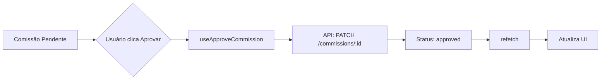
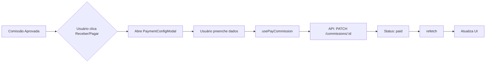

# Documentação Técnica: Separação de Comissões

**Data:** 02/10/2025  
**Versão:** 1.0  
**Status:** ✅ Implementado

---

## 📁 Estrutura de Arquivos

### Páginas Principais
```
src/pages/comissoes/
├── index.tsx                      # Redirect para /comissoes/escritorio
├── ComissoesEscritorio.tsx       # Página de comissões de escritório (280 linhas)
└── ComissoesVendedores.tsx       # Página de comissões de vendedores (320 linhas)
```

### Componentes Compartilhados
```
src/components/commissions/shared/
├── CommissionStatusBadge.tsx     # Badge de status contextualizado (50 linhas)
├── CommissionActions.tsx         # Botões de ação (Aprovar/Pagar/Receber) (70 linhas)
└── CommissionExportButton.tsx    # Exportação para Excel contextualizada (60 linhas)
```

### Componentes de Escritório
```
src/components/commissions/office/
├── OfficeCommissionFilters.tsx   # Filtros específicos de escritório (120 linhas)
├── OfficeCommissionMetrics.tsx   # Cards de métricas de escritório (80 linhas)
└── OfficeCommissionTable.tsx     # Tabela de comissões de escritório (150 linhas)
```

### Componentes de Vendedores
```
src/components/commissions/seller/
├── SellerCommissionFilters.tsx   # Filtros específicos de vendedor (130 linhas)
├── SellerCommissionMetrics.tsx   # Cards de métricas de vendedor (90 linhas)
└── SellerCommissionTable.tsx     # Tabela de comissões de vendedor (150 linhas)
```

### Hooks Customizados
```
src/hooks/commissions/
├── useOfficeCommissions.ts       # Hook para comissões de escritório (90 linhas)
└── useSellerCommissionsData.ts   # Hook para comissões de vendedor (100 linhas)
```

---

## 🔗 Rotas

### Estrutura de Navegação
```typescript
/comissoes                          → Redirect para /comissoes/escritorio
/comissoes/escritorio              → Página de Comissões de Escritório
/comissoes/vendedores              → Página de Comissões de Vendedores
```

### Configuração no App.tsx
```typescript
import Comissoes from '@/pages/comissoes';
import ComissoesEscritorio from '@/pages/comissoes/ComissoesEscritorio';
import ComissoesVendedores from '@/pages/comissoes/ComissoesVendedores';

// Dentro de ProtectedRoute
<Route path="/comissoes" element={<Comissoes />} />
<Route path="/comissoes/escritorio" element={<ComissoesEscritorio />} />
<Route path="/comissoes/vendedores" element={<ComissoesVendedores />} />
```

### Navegação no Sidebar
```typescript
{
  name: 'Comissões',
  path: '/comissoes',
  icon: DollarSign,
  enabled: menuConfig?.modules?.commissions || false,
  subItems: [
    { name: 'Escritório', path: '/comissoes/escritorio' },
    { name: 'Vendedores', path: '/comissoes/vendedores' }
  ]
}
```

---

## 🧩 Componentes

### CommissionStatusBadge
**Propósito:** Exibir status de comissão com contexto apropriado

**Props:**
```typescript
interface CommissionStatusBadgeProps {
  status: 'pending' | 'approved' | 'paid' | 'cancelled';
  type: 'office' | 'seller';
}
```

**Comportamento:**
- `pending` → "Pendente" (ambos tipos)
- `approved` + `office` → "A Receber"
- `approved` + `seller` → "A Pagar"
- `paid` + `office` → "Recebida"
- `paid` + `seller` → "Paga"

### CommissionActions
**Propósito:** Renderizar ações apropriadas baseadas no status e tipo

**Props:**
```typescript
interface CommissionActionsProps {
  commission: Commission;
  type: 'office' | 'seller';
  onApprove?: () => void;
  onPay?: () => void;
  isLoading?: boolean;
}
```

**Lógica:**
- Status `pending` → Botão "Aprovar"
- Status `approved` + `office` → Botão "Receber"
- Status `approved` + `seller` → Botão "Pagar"
- Status `paid` → Sem ações

### CommissionExportButton
**Propósito:** Exportar comissões para Excel com colunas contextualizadas

**Props:**
```typescript
interface CommissionExportButtonProps {
  data: Commission[];
  filename: string;
  type: 'office' | 'seller';
}
```

**Colunas Exportadas:**
- **Comum:** Venda, Cliente, Vendedor, Escritório, Valor Base, Taxa, Comissão, Vencimento, Status
- **Office:** Data Aprovação, Data Recebimento, Forma Recebimento
- **Seller:** Data Aprovação, Data Pagamento, Forma Pagamento

---

## 🪝 Hooks

### useOfficeCommissions
**Propósito:** Gerenciar comissões de escritório com métricas automatizadas

**Assinatura:**
```typescript
function useOfficeCommissions(filters?: OfficeCommissionFilters): {
  commissions: Commission[];
  isLoading: boolean;
  refetch: () => void;
  metrics: {
    totalToReceive: number;
    totalReceived: number;
    avgTicket: number;
    byOffice: Array<{ id: string; name: string; total: number; count: number }>;
    byProduct: Array<{ id: string; name: string; total: number; count: number }>;
    activeOffices: number;
  };
}
```

**Filtros Disponíveis:**
```typescript
interface OfficeCommissionFilters {
  office_id?: string;
  seller_id?: string;
  product_id?: string;
  month?: string;
  year?: string;
  min_value?: number;
  max_value?: number;
  status?: string;
}
```

**Lógica Interna:**
- Sempre adiciona `commission_type: 'office'` aos filtros
- Calcula métricas em tempo real usando `useMemo`
- Agrupa dados por escritório e produto

### useSellerCommissionsData
**Propósito:** Gerenciar comissões de vendedor com ranking e métricas

**Assinatura:**
```typescript
function useSellerCommissionsData(filters?: SellerCommissionFilters): {
  commissions: Commission[];
  isLoading: boolean;
  refetch: () => void;
  metrics: {
    totalToPay: number;
    totalPaid: number;
    avgPerSeller: number;
    topSellers: Array<{ id: string; name: string; total: number; count: number }>;
    bySeller: Array<{ id: string; name: string; total: number; count: number }>;
    byProduct: Array<{ id: string; name: string; total: number; count: number }>;
    activeSellers: number;
  };
}
```

**Filtros Disponíveis:**
```typescript
interface SellerCommissionFilters {
  seller_id?: string;
  office_id?: string;
  product_id?: string;
  month?: string;
  year?: string;
  min_value?: number;
  max_value?: number;
  payment_method?: string;
  status?: string;
}
```

**Lógica Interna:**
- Sempre adiciona `commission_type: 'seller'` aos filtros
- Calcula métricas em tempo real usando `useMemo`
- Gera ranking top 5 vendedores
- Agrupa dados por vendedor e produto

---

## 🎨 Páginas

### ComissoesEscritorio
**Tabs:**
1. **Resumo** - Métricas + Todas comissões
2. **Pendentes** - Comissões aguardando aprovação
3. **A Receber** - Comissões aprovadas
4. **Recebidas** - Histórico de recebimentos

**Métricas:**
- Total a Receber (status: approved)
- Total Recebido (status: paid)
- Ticket Médio
- Escritórios Ativos

**Ações:**
- Aprovar comissão (pending → approved)
- Receber comissão (approved → paid com modal)

### ComissoesVendedores
**Tabs:**
1. **Resumo** - Métricas + Todas comissões
2. **Pendentes** - Comissões aguardando aprovação
3. **A Pagar** - Comissões aprovadas
4. **Pagas** - Histórico de pagamentos
5. **Configurações** - Gerenciar taxas de comissão

**Métricas:**
- Total a Pagar (status: approved)
- Total Pago (status: paid)
- Média por Vendedor
- Vendedores Ativos

**Ações:**
- Aprovar comissão (pending → approved)
- Pagar comissão (approved → paid com modal)
- Configurar taxas (tab específica)

---

## 🔄 Fluxos de Dados

### Fluxo de Aprovação


### Fluxo de Recebimento/Pagamento


### Fluxo de Filtros

```mermaid
graph LR
    A[Usuário altera filtro] --> B[onChange handler]
    B --> C[setFilters]
    C --> D[useOfficeCommissions/useSellerCommissionsData]
    D --> E[useCommissions com filtros]
    E --> F[Supabase Query]
    F --> G[Retorna dados filtrados]
    G --> H[Calcula métricas]
    H --> I[Atualiza UI]
```


---

## 🧪 Testes Recomendados

### Testes Funcionais
- [ ] Navegação entre tabs funciona
- [ ] Filtros aplicam corretamente
- [ ] Aprovação de comissão funciona
- [ ] Recebimento (office) funciona com modal
- [ ] Pagamento (seller) funciona com modal
- [ ] Exportação Excel gera arquivo correto
- [ ] Redirect /comissoes → /comissoes/escritorio

### Testes de UX
- [ ] Labels contextualizados (Receber vs Pagar)
- [ ] Badges corretos por tipo
- [ ] Métricas calculadas corretamente
- [ ] Paginação funciona
- [ ] Estados de loading adequados
- [ ] Toast notifications aparecem

### Testes de Performance
- [ ] useMemo previne recálculos desnecessários
- [ ] Filtros não causam lag
- [ ] Tabelas com 1000+ registros performam bem
- [ ] Exportação de grandes volumes funciona

---

## 📝 Notas de Implementação

### Decisões Técnicas

1. **Por que separar em dois hooks?**
   - Cada hook tem lógica de métricas específica
   - Filtros automáticos por tipo evitam erros
   - Facilita manutenção futura

2. **Por que usar `(c as any)` nos hooks?**
   - Tipos do Supabase não incluem joins automáticos
   - Propriedades como `office_name`, `product_name` vêm de joins
   - Solução temporária até tipos serem atualizados

3. **Por que manter Comissoes.tsx original?**
   - Compatibilidade com links existentes
   - Facilita rollback se necessário
   - Será depreciado em versão futura

### Melhorias Futuras

1. **Gráficos e Visualizações**
   - Adicionar gráfico de tendência no tab Resumo
   - Breakdown visual por escritório/vendedor
   - Timeline de recebimentos/pagamentos

2. **Filtros Avançados**
   - Salvar filtros como presets
   - Filtros por múltiplos valores
   - Busca textual por cliente/contrato

3. **Ações em Lote**
   - Aprovar múltiplas comissões
   - Receber/Pagar em lote
   - Exportar seleção customizada

4. **Notificações**
   - Alertas de comissões vencidas
   - Notificação ao vendedor após pagamento
   - Resumo mensal por email

---

## 🔗 Referências

- **Documentação Original:** `documentacao/analise/diagnostico-separacao-comissoes-02-10-2025.md`
- **Plano de Implementação:** `documentacao/frontend/plano-implementacao-separacao-comissoes.md`
- **Hooks Base:** `src/hooks/useCommissions.ts`
- **Tipos:** `src/types/filterTypes.ts`

---

## 📞 Suporte

Para dúvidas ou problemas com este módulo:
1. Consultar esta documentação
2. Verificar logs do console
3. Revisar código dos hooks e componentes
4. Contatar equipe de desenvolvimento
