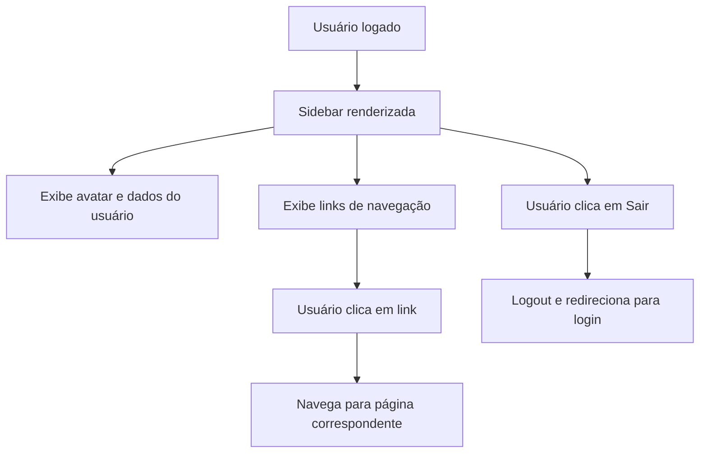

# Documentação do Componente: AppSidebar

## Data da Última Atualização
**01/10/2025 - 00:30h** - Enriquecimento do header com dados completos do perfil e mensagens dinâmicas

## Propósito
Componente responsável por renderizar a barra lateral de navegação principal do sistema, agrupando links de acesso rápido às principais páginas, módulos de gestão e configurações do sistema, além de exibir informações completas do usuário logado com mensagens de boas-vindas contextualizadas.

## Principais Funções
- Exibir links de navegação para páginas principais (Dashboard, CRM, Clientes, Vendas, Vendedores, etc.)
- Agrupar itens de menu por contexto (Principal, Gestão, Sistema)
- **Exibir informações completas do usuário autenticado**:
  - Foto de perfil (miniatura com fallback para iniciais)
  - Nome completo (com destaque para primeiro nome)
  - Empresa/Tenant associado
  - Escritório (quando aplicável)
  - Perfil de acesso (Proprietário, Administrador, Gerente, etc.)
- **Mensagens de boas-vindas dinâmicas**:
  - Contextualizadas por período do dia (manhã, tarde, noite)
  - Mensagens motivacionais rotativas
  - Personalização com primeiro nome do usuário
- Permitir logout seguro do sistema
- Suporte a colapso/expansão da sidebar (responsividade)
- Exibir avatar do usuário com dados reais do perfil
- Sistema de notificações integrado

## Componentes Utilizados
- `Sidebar`, `SidebarContent`, `SidebarGroup`, `SidebarGroupContent`, `SidebarGroupLabel`, `SidebarMenu`, `SidebarMenuButton`, `SidebarMenuItem`, `useSidebar` (UI customizada)
- `Button` (UI)
- `UserAvatar` (avatar do usuário com tamanho "lg")
- `Skeleton` (placeholder de carregamento)
- `NotificationBell` (notificações do sistema)
- Ícones: `Home`, `Users`, `ShoppingCart`, `UserCheck`, `DollarSign`, `BarChart3`, `Building2`, `Settings`, `Shield`, `FileText`, `Target`, `Building`, `LogOut`, `Calculator`, `Briefcase`, `Car`, `MessageSquare`, `FileSpreadsheet`, `Play`, `FileWarning`, `User` (lucide-react)
- **Hooks Customizados**:
  - `useAuth` - Autenticação e logout
  - `useProfile` - Dados completos do perfil e organização
  - `useUserMenuConfig` - Configuração do menu baseada em permissões
  - `useGreeting` - Mensagens de boas-vindas dinâmicas
  - `useLocation`, `useNavigate` - Roteamento

## RPD (Responsabilidades, Permissões e Dados)
- **Responsabilidades:**
  - Centralizar navegação do sistema
  - Exibir contexto do usuário e empresa
  - Gerenciar sessão do usuário (logout)
- **Permissões:**
  - Apenas usuários autenticados visualizam e interagem com a sidebar
  - Itens de menu podem ser customizados conforme permissões do usuário (extensível)
- **Dados:**
  - Dados do usuário logado (nome, cargo, departamento, escritório, avatar)
  - Dados do tenant/empresa ativa

## Schema
- Não há schema de dados próprio, mas consome:
  - Usuário: `{ id, full_name, role, department, office, avatar_url }`
  - Tenant: `{ tenant_name }`
- Integração com contexto de autenticação e hooks customizados

## FlowChart (Fluxo de Navegação)

## Integração com Outras Telas/Componentes
- Navegação para todas as páginas principais do sistema
- Consome dados de autenticação e contexto do usuário
- Utiliza componentes de UI compartilhados para padronização visual

## Observações Técnicas
- Totalmente responsivo, com colapso automático para ícones
- Layout inteligente que adapta informações conforme estado collapsed/expanded
- Logout seguro com limpeza de tokens e redirecionamento
- Estrutura modular e extensível para novos itens de menu
- Utiliza Tailwind CSS para estilização com semantic tokens
- **Sistema de saudações dinâmicas**:
  - Mensagens mudam conforme horário do dia
  - Atualização automática a cada hora
  - Rotação aleatória de mensagens motivacionais
- **Hierarquia visual aprimorada**:
  - Avatar em tamanho "lg" para melhor destaque
  - Cards de informação organizados por contexto
  - Separadores visuais para melhor legibilidade
  - Perfil de acesso destacado com cor primary

## Changelog

### 01/10/2025 - 00:30h
**Enriquecimento do Header com Dados Completos**

#### Adicionado:
- ✅ Sistema de mensagens de boas-vindas dinâmicas (`useGreeting`)
- ✅ Utilitários para geração de saudações (`greetingMessages.ts`)
- ✅ Exibição de foto de perfil em tamanho maior (lg)
- ✅ Exibição do primeiro nome na saudação
- ✅ Card de informações organizacionais:
  - Empresa/Tenant
  - Escritório (quando aplicável)
  - Perfil de acesso com tradução para português
- ✅ Mensagens contextualizadas por período:
  - Manhã (06h-12h)
  - Tarde (12h-18h)
  - Noite (18h-22h)
  - Madrugada (22h-06h)

#### Modificado:
- 🔄 Substituído `useCurrentUser` por `useProfile` para dados mais completos
- 🔄 Layout do header expandido para mostrar mais informações
- 🔄 Melhorada hierarquia visual com separadores e espaçamentos
- 🔄 Avatar aumentado de "md" para "lg"

#### Funcionalidades:
- 💡 Mensagens motivacionais rotativas (5 variações por período)
- 💡 Atualização automática de saudação a cada hora
- 💡 Adaptação responsiva para modo collapsed
- 💡 Tradução de roles para português
- 💡 Posicionamento otimizado do NotificationBell

#### Arquivos Criados:
- `src/utils/greetingMessages.ts`
- `src/hooks/useGreeting.ts`

#### Arquivos Modificados:
- `src/components/AppSidebar.tsx`

## Visão para IA
Esta documentação detalha a estrutura, funções e integrações do componente AppSidebar, facilitando a compreensão para desenvolvedores e sistemas de IA sobre como centralizar a navegação, exibir contexto do usuário e garantir segurança na sessão.