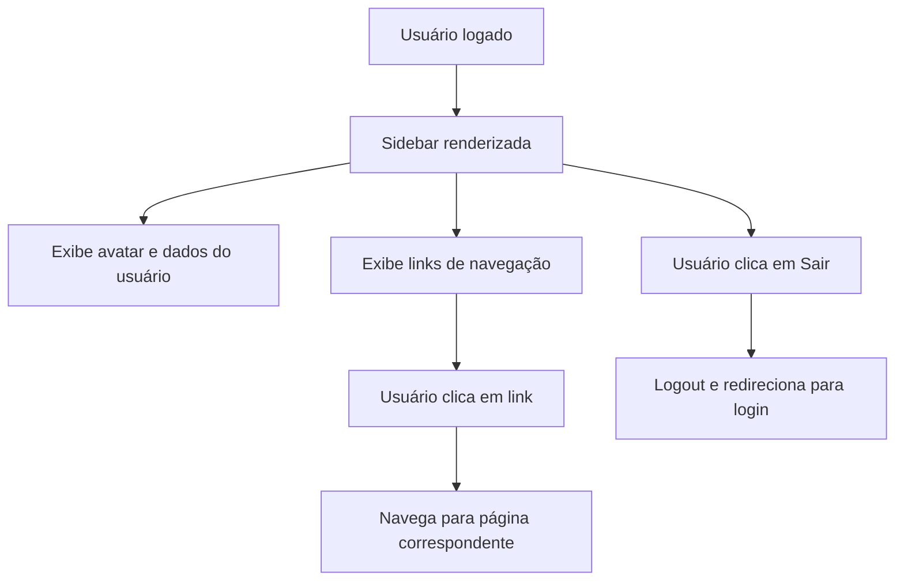

# Documentação do Componente: AppSidebar

## Propósito
Componente responsável por renderizar a barra lateral de navegação principal do sistema, agrupando links de acesso rápido às principais páginas, módulos de gestão e configurações do sistema, além de exibir informações do usuário logado e permitir logout.

## Principais Funções
- Exibir links de navegação para páginas principais (Dashboard, CRM, Clientes, Vendas, Vendedores, etc.)
- Agrupar itens de menu por contexto (Principal, Gestão, Sistema)
- Exibir informações do usuário autenticado (nome, cargo, departamento, escritório)
- Permitir logout seguro do sistema
- Suporte a colapso/expansão da sidebar (responsividade)
- Exibir atalhos de teclado para navegação rápida
- Exibir avatar do usuário e nome da empresa/tenant

## Componentes Utilizados
- `Sidebar`, `SidebarContent`, `SidebarGroup`, `SidebarGroupContent`, `SidebarGroupLabel`, `SidebarMenu`, `SidebarMenuButton`, `SidebarMenuItem`, `useSidebar` (UI customizada)
- `Button` (UI)
- `UserAvatar` (avatar do usuário)
- `Skeleton` (placeholder de carregamento)
- Ícones: `Home`, `Users`, `ShoppingCart`, `UserCheck`, `DollarSign`, `BarChart3`, `Building2`, `Settings`, `Shield`, `FileText`, `Target`, `UsersIcon`, `Building`, `LogOut`, `Calculator`, `Briefcase`, `Car` (lucide-react)
- Hooks: `useAuth`, `useCurrentUser`, `useLocation`, `useNavigate`

## RPD (Responsabilidades, Permissões e Dados)
- **Responsabilidades:**
  - Centralizar navegação do sistema
  - Exibir contexto do usuário e empresa
  - Gerenciar sessão do usuário (logout)
- **Permissões:**
  - Apenas usuários autenticados visualizam e interagem com a sidebar
  - Itens de menu podem ser customizados conforme permissões do usuário (extensível)
- **Dados:**
  - Dados do usuário logado (nome, cargo, departamento, escritório, avatar)
  - Dados do tenant/empresa ativa

## Schema
- Não há schema de dados próprio, mas consome:
  - Usuário: `{ id, full_name, role, department, office, avatar_url }`
  - Tenant: `{ tenant_name }`
- Integração com contexto de autenticação e hooks customizados

## FlowChart (Fluxo de Navegação)

## Integração com Outras Telas/Componentes
- Navegação para todas as páginas principais do sistema
- Consome dados de autenticação e contexto do usuário
- Utiliza componentes de UI compartilhados para padronização visual

## Observações Técnicas
- Totalmente responsivo, com colapso automático para ícones
- Atalhos de teclado exibidos para navegação rápida
- Logout seguro com limpeza de tokens e redirecionamento
- Estrutura modular e extensível para novos itens de menu
- Utiliza Tailwind CSS para estilização

## Visão para IA
Esta documentação detalha a estrutura, funções e integrações do componente AppSidebar, facilitando a compreensão para desenvolvedores e sistemas de IA sobre como centralizar a navegação, exibir contexto do usuário e garantir segurança na sessão.