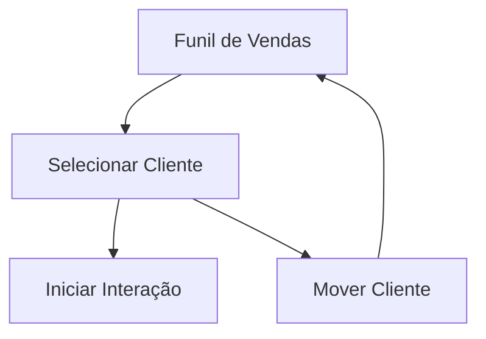

# CRM - Funil de Vendas (SalesFunnelBoard)

## Propósito
Gerenciar visualmente o pipeline de vendas, permitindo arrastar clientes entre fases, visualizar status, classificação e iniciar interações.

## Principais Funções
- Exibição das fases do funil e clientes em cada fase
- Drag & drop para movimentação de clientes
- Seleção de cliente para detalhamento
- Início rápido de interações (WhatsApp, ligação, e-mail)
- Feedback visual e logs de movimentação

## RPD (Responsabilidades, Permissões, Dados)
- Responsável: Vendedores, gestores
- Permissões: Usuários autenticados com acesso ao funil
- Dados: Fases do funil, clientes, posições, status, classificação

## Schema
- Usa hooks: useSalesFunnelStages, useClientFunnelPositions, useUpdateClientFunnelPosition
- Estruturas: ClientCard, FunnelStage

## FlowChart

## Integração
- Seleção de cliente ativa histórico na tela principal (CRM)
- Movimentação reflete nas métricas do dashboard

## Observações Técnicas
- Implementação com drag & drop nativo
- Atualização em tempo real após movimentação
- Feedback visual para ações do usuário

## Visão para IA
Permite automação de sugestões de movimentação, análise de gargalos e previsão de conversão por fase.