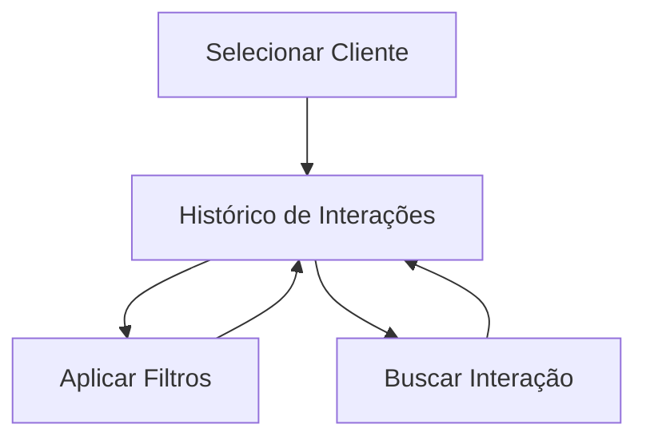

# CRM - Histórico de Interações (ClientInteractionHistory)

## Propósito
Exibir e filtrar o histórico completo de interações de um cliente, permitindo análise detalhada, busca e aplicação de filtros por tipo, prioridade e resultado.

## Principais Funções
- Listagem de todas as interações do cliente
- Filtros avançados (tipo, prioridade, resultado)
- Busca textual nas interações
- Visualização de detalhes (ícones, badges, datas)
- Limpeza rápida de filtros

## RPD (Responsabilidades, Permissões, Dados)
- Responsável: Vendedores, gestores
- Permissões: Usuários autenticados
- Dados: Interações do cliente, tipos, prioridades, resultados

## Schema
- Usa hook: useClientInteractions
- Estruturas: Interaction (campos: tipo, prioridade, resultado, título, descrição, datas)

## FlowChart

## Integração
- Acesso via seleção de cliente no funil ou tarefas
- Filtros e buscas facilitam análise para ações futuras

## Observações Técnicas
- Filtros dinâmicos e busca otimizada
- Atualização automática ao selecionar cliente
- Interface responsiva

## Visão para IA
Permite análise de padrões de interação, sugestões de abordagem personalizada e identificação de clientes com maior potencial de conversão.