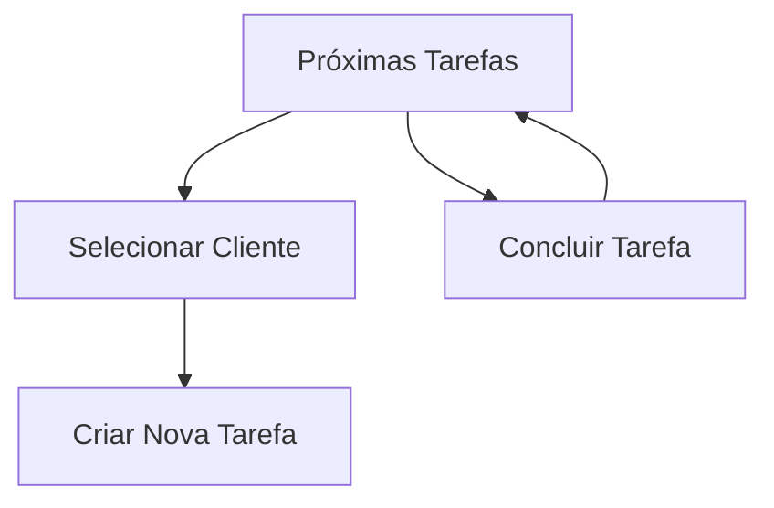

# CRM - Tarefas (UpcomingTasks)

## Propósito
Gerenciar e acompanhar tarefas relacionadas a clientes e interações, permitindo criação, conclusão e filtragem de tarefas futuras e pendentes.

## Principais Funções
- Listagem de tarefas agendadas e pendentes
- Criação de novas tarefas (modal)
- Conclusão de tarefas com feedback visual
- Filtros por cliente e status
- Labels contextuais: Hoje, Amanhã, Atrasado

## RPD (Responsabilidades, Permissões, Dados)
- Responsável: Vendedores, gestores
- Permissões: Usuários autenticados
- Dados: Interações, tarefas, clientes

## Schema
- Usa hooks: useClientInteractions, useClients, useUpdateClientInteraction
- Estruturas: Tarefa (interaction), Cliente

## FlowChart

## Integração
- Criação/conclusão de tarefas reflete no funil e histórico
- Seleção de cliente conecta com histórico e funil

## Observações Técnicas
- Modal para criação de tarefas
- Atualização automática após ações
- Feedback visual para status

## Visão para IA
Permite automação de lembretes, priorização de tarefas e sugestões de follow-up baseadas em contexto e histórico.