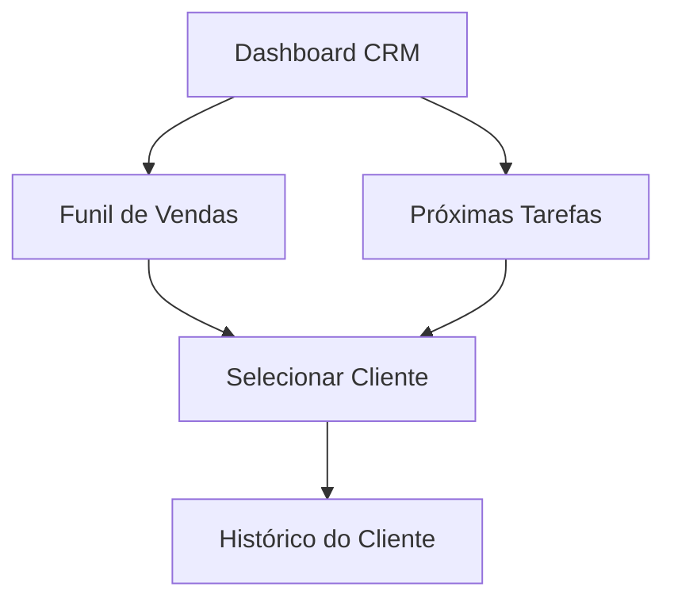

# CRM - Funil de Vendas

## Propósito
Tela central para gestão de clientes, pipeline de vendas, tarefas e histórico de interações. Permite visualizar métricas, acompanhar o funil, gerenciar tarefas e acessar o histórico detalhado de cada cliente.

## Estrutura e Conexões
- **Abas principais:**
  - Funil de Vendas (SalesFunnelBoard)
  - Próximas Tarefas (UpcomingTasks)
  - Histórico do Cliente (ClientInteractionHistory)
- **Integração:**
  - Seleção de cliente no funil ativa a aba de histórico.
  - Tarefas e interações são sincronizadas entre as sessões.

## Principais Funções
- Visualização de métricas (clientes, conversão, interações, tarefas)
- Navegação entre funil, tarefas e histórico
- Integração entre componentes para fluxo contínuo

## RPD (Responsabilidades, Permissões, Dados)
- Responsável: Equipe de vendas/gestores
- Permissões: Usuários autenticados com acesso ao CRM
- Dados: Clientes, interações, tarefas, fases do funil

## Schema
- Dados consumidos via hooks: useSalesFunnelStages, useClientFunnelPositions, useClientInteractions
- Estruturas detalhadas nos arquivos dos componentes conectados

## FlowChart

## Telas Relacionadas
- [CRM-Funil.md](./CRM-Funil.md)
- [CRM-Tarefas.md](./CRM-Tarefas.md)
- [CRM-Historico.md](./CRM-Historico.md)

## Observações Técnicas
- Navegação por abas
- Atualização em tempo real via hooks
- Componentização para reuso e manutenção

## Visão para IA
A tela CRM serve como orquestradora das sessões de funil, tarefas e histórico, permitindo automação de fluxos, sugestões de follow-up e análise de performance.