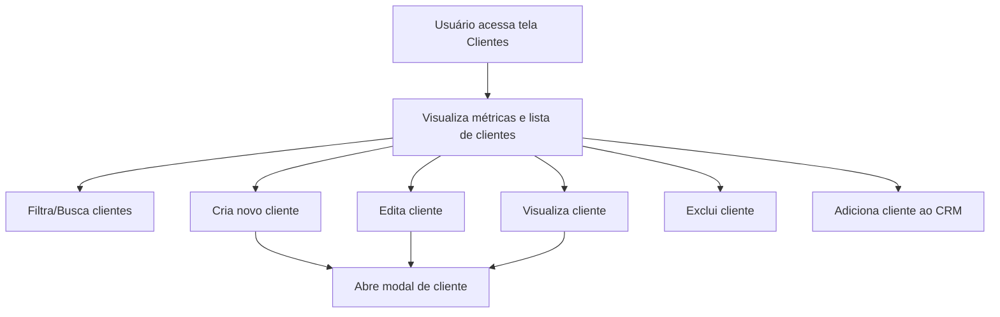

# Clientes

## Propósito
Tela dedicada ao gerenciamento da base de clientes, permitindo cadastro, edição, visualização, exclusão, filtragem e integração com o funil de vendas (CRM).

## Principais Funções
- Listar todos os clientes cadastrados
- Buscar clientes por nome, email ou documento
- Filtrar clientes por status (prospect, ativo, inativo) e classificação (hot, warm, cold)
- Visualizar métricas rápidas (total, prospects, ativos, taxa de conversão)
- Criar, editar, visualizar e excluir clientes
- Adicionar clientes ao funil de vendas (CRM)
- Modal para cadastro/edição/visualização de clientes

## Componentes Utilizados
- Card, CardContent, CardHeader, CardTitle
- Button, Input, Badge
- Table, TableBody, TableCell, TableHead, TableHeader, TableRow
- Select, SelectContent, SelectItem, SelectTrigger, SelectValue
- Avatar, AvatarFallback
- Icons: Plus, Search, Filter, Users, UserCheck, Clock, Eye, Edit, Trash2
- ClientModal (modal para manipulação de clientes)
- Hooks: useClients, useDeleteClient, useUpdateClientFunnelPosition, useSalesFunnelStages, useCreateDefaultFunnelStages, useToast

## RPD (Responsabilidades, Permissões e Dados)
- Responsável: Usuários autenticados com permissão de gestão de clientes
- Permissões: Visualizar, criar, editar, excluir clientes; adicionar ao CRM
- Dados manipulados: Dados cadastrais do cliente (nome, email, telefone, documento, status, classificação, tipo)

## Schema
- Cliente: { id, name, email, phone, document, status, classification, type }
- Métricas: total, prospects, active, inactive
- Filtros: searchTerm, statusFilter, classificationFilter

## FlowChart

## Integração com Outras Telas/Componentes
- Integração direta com o CRM: botão para adicionar cliente ao funil de vendas
- Utiliza ClientModal para manipulação de dados do cliente
- Relacionamento com hooks de funil de vendas para integração com etapas do CRM

## Observações Técnicas
- Criação automática de fases do funil caso não existam ao tentar adicionar cliente ao CRM
- Uso de hooks customizados para manipulação de dados e feedback ao usuário
- Interface responsiva e adaptada para diferentes tamanhos de tela

## Visão para IA
Esta documentação detalha a estrutura, funções e integrações da tela de Clientes, facilitando a compreensão para desenvolvedores e sistemas de IA sobre como gerenciar clientes e integrá-los ao funil de vendas. Para detalhes do funil, consultar a documentação do CRM.