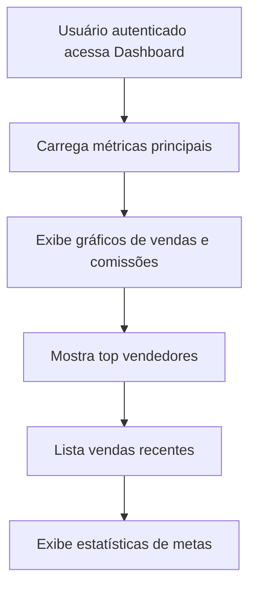

# Dashboard

## 📋 Propósito da Tela
Tela principal de acompanhamento de indicadores do sistema Argus360, exibindo métricas, gráficos, vendas recentes e estatísticas de metas para tomada de decisão rápida.

## 🏆 Principais Funções
- Exibir métricas principais (vendas, comissões, vendedores ativos, meta mensal)
- Visualizar gráficos de vendas mensais e evolução de comissões
- Listar top vendedores em gráfico de pizza
- Apresentar vendas recentes
- Mostrar estatísticas detalhadas de metas
- Interface responsiva e visualmente rica

## 🧩 Componentes Utilizados
- Cards de métricas (MetricCard)
- Gráficos (BarChart, LineChart, PieChart via recharts)
- Listagem de vendas recentes
- Cards e headers reutilizáveis (Card, CardHeader, CardContent, CardTitle)
- Ícones (lucide-react)

## 🔄 RPD (Responsabilidade, Permissão, Dados)
- **Responsabilidade:** Exibir dados analíticos e operacionais para usuários autenticados
- **Permissão:** Acesso restrito a usuários logados
- **Dados:** Consome dados dinâmicos via hooks (useGoals, useGoalStats, useDashboardStats)

## 🗂️ Schema de Dados
```typescript
interface DashboardStats {
  monthSales: number;
  monthCommissions: number;
  activeVendedores: number;
  goalCompletion: number;
  monthlyData: Array<{ month: string; vendas: number; meta: number; comissoes: number }>;
  topVendedores: Array<{ name: string; total_sales: number }>;
  recentSales: Array<{ client_name: string; vendedor_name: string; sale_value: number; commission_amount: number; sale_date: string }>;
}

interface GoalStats {
  totalGoals: number;
  completedGoals: number;
  averageProgress: number;
}
```

## 🗺️ FlowChart de Navegação


## 📝 Observações Técnicas
- Implementada em React + TypeScript
- Estilização com Tailwind CSS (mobile-first)
- Utiliza hooks customizados para fetch de dados (React Query + Supabase)
- Gráficos com biblioteca recharts
- Navegação protegida por autenticação
- Componentização para reuso e clareza

## 🤖 Visão para IA
Esta documentação fornece contexto detalhado sobre a tela Dashboard, facilitando onboarding de desenvolvedores e compreensão automatizada por agentes de IA.