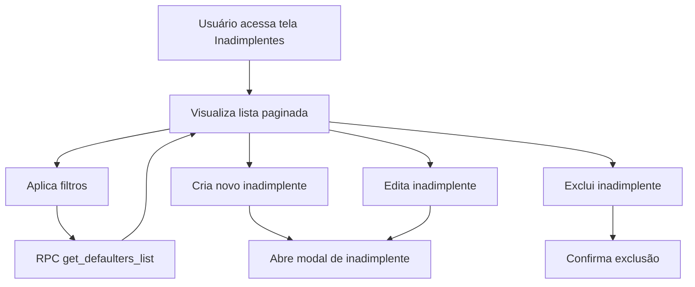

# Inadimplentes

**Data de Criação:** 2025-09-30  
**Última Atualização:** 2025-09-30

## Propósito
Tela dedicada ao gerenciamento de clientes inadimplentes no sistema, permitindo cadastro, edição, visualização e exclusão de registros de inadimplência, com filtros avançados e paginação otimizada.

## Principais Funções
- Listar todos os inadimplentes cadastrados com paginação
- Criar, editar e excluir registros de inadimplentes
- Exibir informações detalhadas: cliente, proposta, situação de cobrança, parcelas vencidas, valores, contatos
- Filtrar por nome/proposta, status da cota e situação de cobrança
- Modal para cadastro/edição de inadimplentes
- Confirmação de exclusão com AlertDialog
- Feedback ao usuário via toast
- Paginação server-side otimizada via RPC

## Componentes Utilizados
- Card, CardContent, CardHeader, CardTitle
- Button, Badge
- Table, TableBody, TableCell, TableHead, TableHeader, TableRow
- AlertDialog e subcomponentes
- DefaultersFilters (componente de filtros customizado)
- DefaulterModal (modal para manipulação de inadimplentes)
- Ícones: Plus, Edit, Trash2, Phone, Mail, FileWarning
- Hooks: useDefaulters, useCreateDefaulter, useUpdateDefaulter, useDeleteDefaulter, useToast

## RPD (Responsabilidades, Permissões e Dados)
- **Responsável:** Usuários autenticados com permissão de gestão de inadimplentes
- **Permissões:** 
  - Visualizar: Todos os usuários do tenant
  - Criar/Editar: Admin, Owner, Manager
  - Excluir: Admin, Owner
- **Dados manipulados:** Dados de inadimplência (cliente, proposta, valores, parcelas, situação de cobrança, contatos)

## Schema

### Tabela: defaulters
```sql
- id (uuid, PK)
- tenant_id (uuid, FK tenants, NOT NULL)
- sale_id (uuid, FK sales, nullable)
- empresa (text)
- cod_revenda (text)
- ata (text)
- revenda (text)
- data_contabilizacao (date)
- data_alocacao (date)
- proposta (text, indexed)
- cod_grupo (text)
- cota (integer)
- sequencia (integer)
- cliente_nome (text, indexed)
- tipo_cota (text)
- bem_descricao (text)
- prazo_cota_meses (integer)
- parcelas_pagas (integer)
- parcelas_vencidas (integer)
- status_cota (text)
- situacao_cobranca (text, indexed)
- valor_bem_venda (numeric)
- valor_bem_atual (numeric)
- telefone (text)
- data_atualizacao (timestamptz)
- email (text)
- created_at (timestamptz, default now())
- updated_at (timestamptz, default now())
```

### Função RPC: get_defaulters_list
**Parâmetros:**
- p_page_number (integer, default 1)
- p_page_size (integer, default 10)
- p_search_term (text, nullable)
- p_status_filter (text, nullable)
- p_situacao_filter (text, nullable)

**Retorno:**
```json
{
  "data": [/* array de defaulters */],
  "total_count": number
}
```

## FlowChart


## Integração com Outras Telas/Componentes
- Integração com DefaulterModal para cadastro e edição
- Uso de AlertDialog para confirmação de exclusão
- Relacionamento com tabela sales via sale_id (opcional)
- Uso de função RPC para listagem otimizada
- Componente DefaultersFilters para filtros avançados

## Observações Técnicas
- **Multi-tenant:** Isolamento total por tenant_id com RLS
- **Performance:** Paginação server-side via RPC reduz tráfego de rede
- **Índices:** Otimizados para buscas por proposta, cliente_nome e situacao_cobranca
- **Validação:** Schema Zod para validação de formulários
- **Formatação:** Valores monetários em padrão brasileiro (R$)
- **Responsividade:** Interface adaptada para diferentes tamanhos de tela
- **Segurança:** RLS policies garantem acesso contextual baseado em roles

## Diferenças em Relação à Tela de Vendas
- Campos específicos de inadimplência (parcelas_vencidas, situacao_cobranca)
- Filtros customizados para status e situação de cobrança
- Relacionamento opcional com vendas via sale_id
- Foco em gestão de cobrança e não em workflow de aprovação

## Visão para IA
Esta documentação detalha a estrutura, funções e integrações da tela de Inadimplentes, facilitando a compreensão para desenvolvedores e sistemas de IA sobre como gerenciar registros de inadimplência, aplicar filtros contextuais e realizar operações CRUD com segurança multi-tenant. A arquitetura segue o padrão estabelecido pela tela de Vendas, garantindo consistência visual e funcional.

## Futuras Melhorias Planejadas
- Integração com ferramenta de upload de planilhas
- Dashboard de inadimplência com gráficos e métricas
- Automação de notificações para cobrança
- Histórico de interações com inadimplentes
- Integração com APIs de bureaus de crédito
- Exportação de relatórios em PDF/Excel
