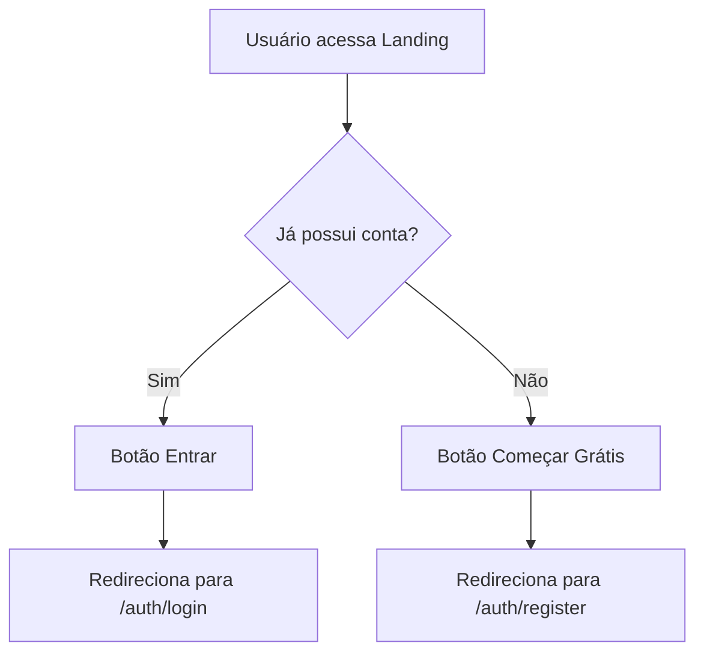

# Landing Page

## 📋 Propósito da Tela
Tela inicial do sistema Argus360, responsável por apresentar a plataforma, principais funcionalidades e direcionar o usuário para login ou cadastro.

## 🏆 Principais Funções
- Exibir branding e slogan do sistema
- Apresentar chamada para ação (CTA) para cadastro e login
- Destacar funcionalidades principais do sistema
- Interface responsiva e visualmente atraente

## 🧩 Componentes Utilizados
- Header com logo e botões de navegação
- Seção Hero com título, descrição e CTAs
- Cards de funcionalidades (Gestão de Vendas, Comissões, Clientes, Relatórios, Automação, Multi-tenant)
- Footer institucional

## 🔄 RPD (Responsabilidade, Permissão, Dados)
- **Responsabilidade:** Apresentação institucional e onboarding inicial
- **Permissão:** Acesso público, sem autenticação
- **Dados:** Não consome dados dinâmicos; conteúdo estático

## 🗂️ Schema de Dados
_Não se aplica para esta tela, pois não há consumo de dados dinâmicos._

## 🗺️ FlowChart de Navegação

## 📝 Observações Técnicas
- Implementada em React + TypeScript
- Estilização com Tailwind CSS (mobile-first)
- Utiliza componentes reutilizáveis (Button, Card, Badge)
- Não há lógica de estado ou hooks
- Navegação via react-router-dom

## 🤖 Visão para IA
Esta documentação visa fornecer contexto claro sobre o propósito, estrutura e fluxo da tela, facilitando onboarding de novos desenvolvedores e compreensão por agentes de IA.