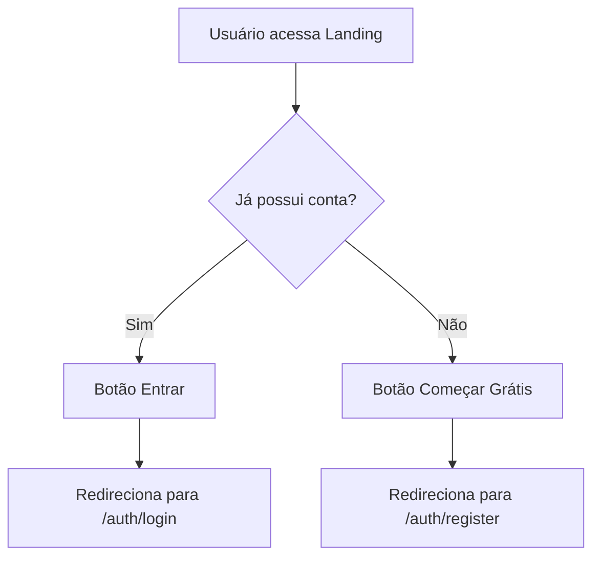

# Landing Page

## 📋 Propósito da Tela
Tela inicial do sistema Argus360, responsável por apresentar a plataforma como SaaS, principais funcionalidades, métricas de impacto e direcionar o usuário para login ou cadastro.

## 🏆 Principais Funções
- Apresentar proposta de valor clara e direta ("Tempo é dinheiro")
- Exibir métricas de impacto (5x mais rápido, 15h foco, +2 vendas, ROI 1 mês)
- Destacar funcionalidades principais com design moderno
- Interface responsiva e design SaaS profissional
- CTAs estratégicos para conversão

## 🧩 Componentes Utilizados
- Header fixo com backdrop blur
- Seção Hero com frases de impacto e gradiente
- Barra de métricas destacada (fundo azul)
- Cards de funcionalidades com hover effects
- Seção CTA intermediária
- Footer moderno

## 🔄 RPD (Responsabilidade, Permissão, Dados)
- **Responsabilidade:** Apresentação institucional e onboarding inicial
- **Permissão:** Acesso público, sem autenticação
- **Dados:** Não consome dados dinâmicos; conteúdo estático

## 🗂️ Schema de Dados
_Não se aplica para esta tela, pois não há consumo de dados dinâmicos._

## 🗺️ FlowChart de Navegação

## 📝 Observações Técnicas
- Implementada em React + TypeScript
- Design moderno SaaS com paleta azul (LinkedIn-like)
- Gradientes sutis e efeitos de hover
- Header fixo com backdrop blur
- Animações e transições suaves
- Estilização com Tailwind CSS (mobile-first)
- Utiliza componentes Shadcn/UI (Button, Card, Badge)
- Não há lógica de estado ou hooks
- Navegação via react-router-dom

## 🎨 Design System
- **Cores Primárias:** Azul (#2563eb a #1e40af) - inspiração LinkedIn
- **Cores Secundárias:** Branco, Cinza claro, Cinza escuro
- **Gradientes:** from-blue-600 to-blue-700, from-blue-50 via-white to-gray-50
- **Efeitos:** hover:shadow-lg, backdrop-blur-md, transition-all

## 📊 Métricas Destacadas
- **5x** orçamentos mais rápidos
- **15h** de foco a mais por mês
- **+2** vendas adicionais por vendedor/mês
- **1 mês** de ROI

## 🔄 Última Atualização
**Data:** 03/10/2025  
**Alteração:** Refatoração completa com design moderno SaaS, novas frases de impacto, barra de métricas e paleta azul LinkedIn-like

## 🤖 Visão para IA
Esta documentação visa fornecer contexto claro sobre o propósito, estrutura e fluxo da tela, facilitando onboarding de novos desenvolvedores e compreensão por agentes de IA.