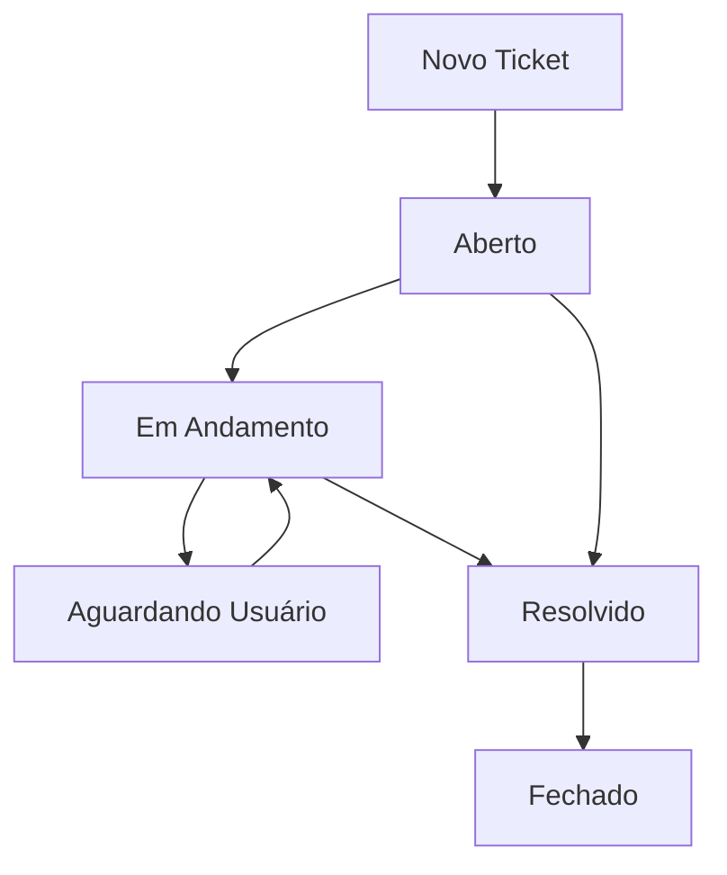

# Documentação da Tela: Portal de Suporte

## Data de Criação: 2025-01-27

## Propósito
Tela responsável por gerenciar o sistema de chamados/tickets de suporte técnico dentro do sistema Argus360. Permite que usuários criem, visualizem, atualizem e acompanhem chamados de suporte, seguindo os princípios de isolamento por tenant.

## Principais Funcionalidades
- **Dashboard de Chamados**: Estatísticas de tickets abertos, resolvidos e fechados
- **Criação de Tickets**: Formulário completo para abertura de novos chamados
- **Listagem Organizada**: Separação entre chamados abertos e finalizados
- **Sistema de Filtros**: Busca por texto, status, prioridade e categoria
- **Visualização Detalhada**: Modal para ver e editar tickets existentes
- **Categorização**: Sistema robusto de categorias (bug, feature, suporte, etc.)
- **Priorização**: Níveis de prioridade (baixa, normal, alta, urgente)
- **Controle de Status**: Fluxo completo de status dos chamados

## Componentes Utilizados
- **Cards Estatísticos**: Métricas de chamados por status
- **Sistema de Tabs**: Separação entre abertos e finalizados
- **Filtros Avançados**: Busca e filtros por múltiplos critérios
- **Modal Inteligente**: Criação e edição de tickets
- **Badges**: Indicadores visuais de status e prioridade
- **Formatação de Datas**: Usando date-fns para datas relativas

## RPD (Responsabilidades, Permissões e Dados)
### Responsabilidades:
- Centralizar gestão de suporte técnico
- Facilitar comunicação entre usuários e suporte
- Manter histórico organizacional de problemas
- Prover métricas de qualidade de atendimento

### Permissões:
- **Criação**: Todos os usuários autenticados podem criar tickets
- **Visualização**: Usuários só veem tickets do próprio tenant
- **Edição**: Usuários podem editar próprios tickets; admins editam todos
- **Resolução**: Somente usuários com privilégios administrativos

### Dados:
- **Tickets**: Título, descrição, categoria, prioridade, status
- **Metadados**: Criador, responsável, datas de criação/resolução
- **Histórico**: Comentários e atualizações do ticket

## Schema do Banco de Dados
### Tabela: support_tickets
```sql
- id (UUID, PK)
- tenant_id (UUID, FK) 
- user_id (UUID, FK)
- assigned_to (UUID, FK, nullable)
- title (VARCHAR(255))
- description (TEXT)
- category (ENUM)
- priority (ENUM) 
- status (ENUM)
- resolution (TEXT, nullable)
- resolved_at/closed_at (TIMESTAMP, nullable)
- created_at/updated_at (TIMESTAMP)
```

### Tabela: support_ticket_comments
```sql
- id (UUID, PK)
- ticket_id (UUID, FK)
- user_id (UUID, FK)
- content (TEXT)
- is_internal (BOOLEAN)
- attachments (JSONB)
- created_at/updated_at (TIMESTAMP)
```

## Fluxo de Estados do Ticket


## Hooks e Integração
### Hooks Utilizados:
- **useSupportTickets**: Listagem com filtros e cache
- **useSupportTicket**: Detalhes de ticket específico
- **useCreateSupportTicket**: Criação de novos tickets
- **useUpdateSupportTicket**: Atualização de tickets existentes
- **useSupportTicketsStats**: Estatísticas para dashboard

### Integração com Outras Telas:
- **AppSidebar**: Novo item de menu "Suporte" 
- **Sistema de Notificações**: Toast para feedback de ações
- **Autenticação**: Controle por tenant e usuário
- **Auditoria**: Logs automáticos de ações nos tickets

## Características Técnicas
### Segurança:
- Row Level Security (RLS) implementado
- Isolamento completo por tenant
- Políticas específicas para cada ação (CREATE, READ, UPDATE)

### Performance:
- Cache inteligente com React Query
- Filtros otimizados no backend
- Lazy loading de detalhes de tickets
- Paginação automática para grandes volumes

### UX/UI:
- Design consistente com sistema existente
- Feedback visual imediato (badges, cores)
- Formulários com validação robusta (Zod + React Hook Form)
- Responsivo para dispositivos móveis

## Casos de Uso Principais
1. **Usuário reporta bug**: Cria ticket categoria "bug", descreve problema
2. **Solicitação de feature**: Ticket "feature_request" com detalhamento
3. **Suporte técnico**: Categoria "technical_support" para dúvidas
4. **Admin resolve ticket**: Atualiza status, adiciona resolução
5. **Acompanhamento**: Usuário visualiza progresso do seu ticket

## Observações Técnicas
- Sistema completamente isolado por tenant (multi-tenancy)
- Preparado para futuras expansões (comentários, anexos)
- Validação client-side e server-side
- Tratamento de erros com feedback ao usuário
- Otimizado para grandes volumes de tickets

## Visão para IA
Esta documentação oferece uma visão completa do sistema de suporte implementado no Argus360, destacando sua arquitetura robusta, segurança por tenant, e interface intuitiva que facilita o gerenciamento de chamados técnicos de forma organizada e eficiente.