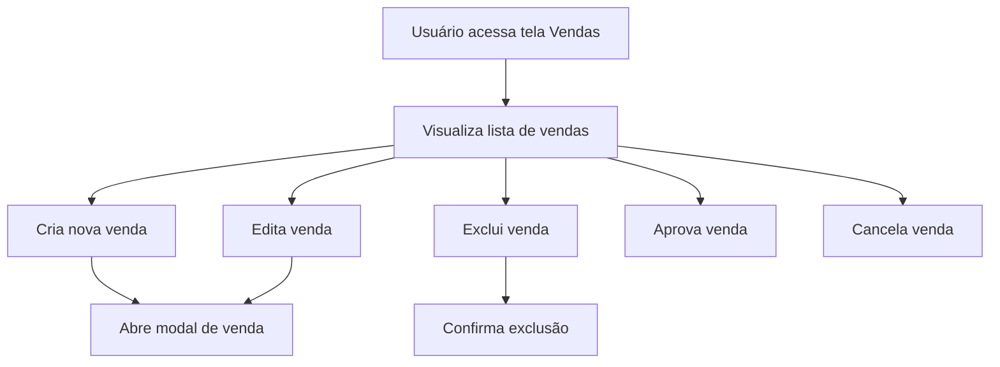

# Vendas

## Propósito
Tela dedicada ao gerenciamento das vendas realizadas no sistema, permitindo cadastro, edição, aprovação, cancelamento e exclusão de vendas, além de exibir informações detalhadas sobre cada venda e suas comissões.

## Principais Funções
- Listar todas as vendas cadastradas
- Criar, editar e excluir vendas
- Aprovar e cancelar vendas
- Exibir informações detalhadas: cliente, produto, valor, comissão, data, status
- Modal para cadastro/edição de vendas
- Confirmação de exclusão com AlertDialog
- Feedback ao usuário via toast

## Componentes Utilizados
- Card, CardContent, CardHeader, CardTitle
- Button, Badge
- Table, TableBody, TableCell, TableHead, TableHeader, TableRow
- AlertDialog e subcomponentes
- SaleModal (modal para manipulação de vendas)
- Ícones: Plus, Edit, Trash2, CheckCircle, X
- Hooks: useSales, useCreateSale, useUpdateSale, useDeleteSale, useToast

## RPD (Responsabilidades, Permissões e Dados)
- Responsável: Usuários autenticados com permissão de gestão de vendas
- Permissões: Visualizar, criar, editar, aprovar, cancelar e excluir vendas
- Dados manipulados: Dados da venda (cliente, produto, valor, comissão, data, status)

## Schema
- Venda: { id, client_id, product_id, sale_value, commission_amount, commission_rate, sale_date, status, approval_date, cancellation_date }
- Cliente: { id, name }
- Produto: { id, name }

## FlowChart

## Integração com Outras Telas/Componentes
- Integração com SaleModal para cadastro e edição de vendas
- Uso de AlertDialog para confirmação de exclusão
- Relacionamento com hooks de vendas para manipulação dos dados

## Observações Técnicas
- Utilização de React Query para manipulação de dados server state
- Feedback ao usuário com toasts para todas as ações críticas
- Interface responsiva e adaptada para diferentes tamanhos de tela
- Formatação de valores monetários e datas conforme padrão brasileiro

## Visão para IA
Esta documentação detalha a estrutura, funções e integrações da tela de Vendas, facilitando a compreensão para desenvolvedores e sistemas de IA sobre como gerenciar vendas, aprovações, cancelamentos e integrações com clientes e produtos. Para detalhes de comissão, consultar documentação relacionada a comissões e produtos.