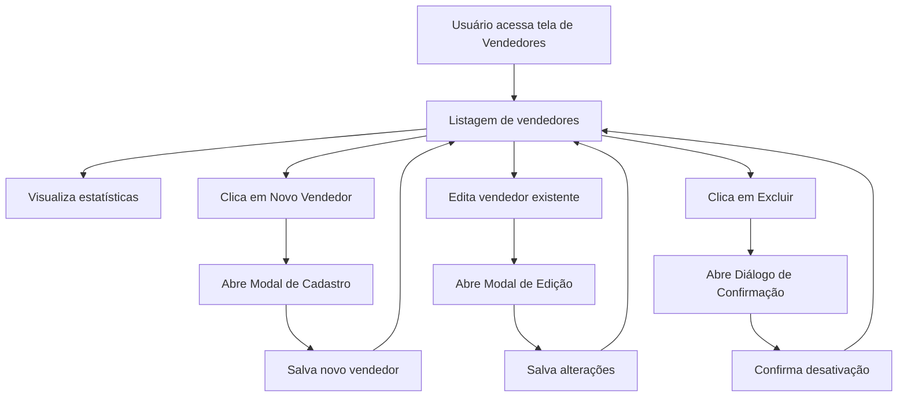

# Documentação da Tela: Vendedores

## Propósito
Tela dedicada ao gerenciamento da equipe de vendas, permitindo visualizar, cadastrar, editar, desativar e analisar vendedores, suas vendas e comissões.

## Principais Funções
- Listagem de vendedores com informações detalhadas (nome, contato, departamento, status, vendas, comissões)
- Cadastro de novos vendedores
- Edição de dados de vendedores existentes
- Desativação (exclusão lógica) de vendedores
- Visualização de estatísticas agregadas (total de vendedores, ativos, vendas e comissões)
- Modal para criação/edição de vendedor
- Confirmação de desativação com diálogo
- Responsividade para dispositivos móveis e desktop

## Componentes Utilizados
- `VendedorStats`: Exibe estatísticas agregadas da equipe
- `VendedorModal`: Modal para criar/editar vendedor
- `ConfirmDialog`: Diálogo de confirmação para desativação
- `Card`, `Badge`, `Button`, `Table`, `Avatar`, `AvatarFallback`: UI
- Ícones: `Plus`, `Mail`, `Phone`, `Edit`, `Trash2` (lucide-react)
- Hook: `useVendedores` (gerenciamento de dados e operações CRUD)

## RPD (Responsabilidades, Permissões e Dados)
- **Responsabilidades:**
  - Exibir e gerenciar vendedores
  - Permitir operações CRUD (criar, editar, desativar)
  - Mostrar estatísticas de vendas e comissões
- **Permissões:**
  - Apenas usuários autenticados e com permissão de gestão podem acessar e modificar vendedores
- **Dados:**
  - Dados dos vendedores (nome, email, telefone, departamento, status, vendas, comissões)
  - Dados agregados para estatísticas

## Schema
- Utiliza o tipo `Profile` do banco (Tabela: `profiles`)
- Campos principais: `id`, `full_name`, `email`, `phone`, `position`, `department`, `settings`, `sales_count`, `commission_total`
- Integração com hooks e banco via Supabase

## FlowChart (Fluxo de Navegação)

## Integração com Outras Telas/Componentes
- Relaciona-se com telas de vendas, clientes e dashboard para exibir dados agregados
- Utiliza hooks e componentes compartilhados para padronização de UI e lógica

## Observações Técnicas
- Responsividade aprimorada: cards para mobile, tabela para desktop
- Exclusão é lógica (desativação), permitindo reversão
- Utiliza hooks customizados para centralizar lógica de dados
- Modal e diálogos garantem UX fluida e segura

## Visão para IA
Esta documentação detalha a estrutura, funções e integrações da tela de Vendedores, facilitando a compreensão para desenvolvedores e sistemas de IA sobre como gerenciar a equipe de vendas, suas permissões e integrações com outros módulos do sistema.